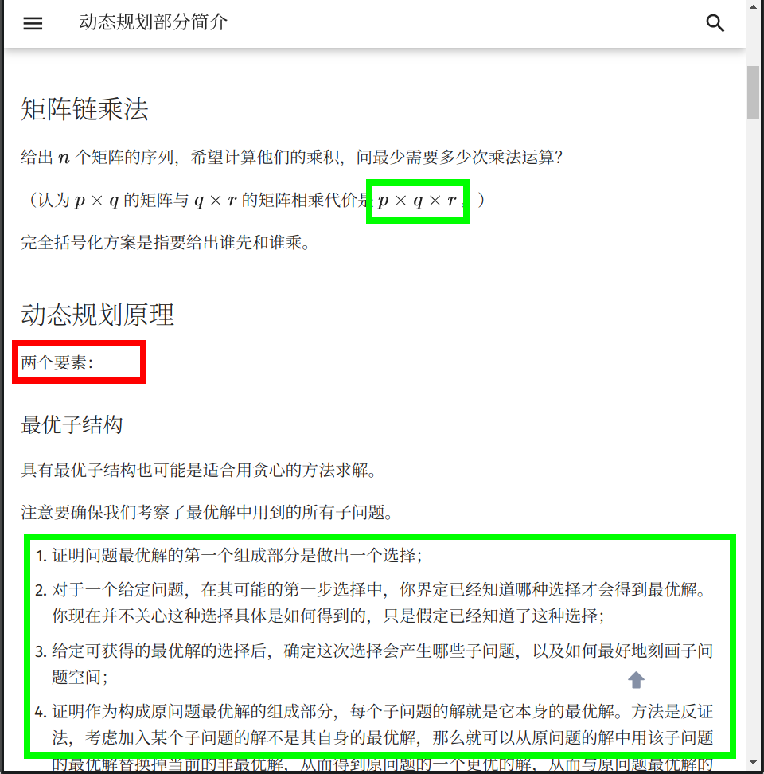
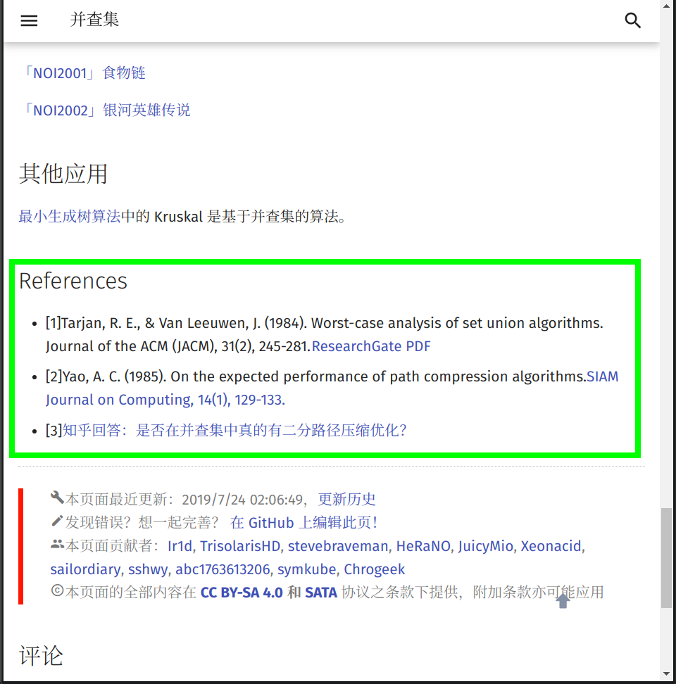

在文章開始之前，**NCKUME wiki** 專案組全體成員十分歡迎您為本專案貢獻頁面。正因為有了上百位像您一樣的人，才有了 **NCKUME wiki** 的今天！

本頁面將列出在 **NCKUME wiki** 編寫過程時推薦使用的格式規範與編輯方針。請您在撰稿或者修正 Wiki 頁面以前，仔細閱讀以下內容，以説明您完成更高品質的內容。

如果您已迫不及待，想要快速上手，建議先閱讀圖片舉例的章節。

## 貢獻文檔要求

當你打算貢獻某部分的內容時，你應該儘量熟悉以下四部分：

-   文檔內容來源的權威性
-   文檔存儲的格式
-   文檔的合理性
-   remark-lint 和 $\rm{\LaTeX}$ 公式的格式要求

### 文檔內容來源的權威性

-   請確保文檔中至少有一個引用來自[**可公開查證**的權威性資料](https://en.wikipedia.org/wiki/Wikipedia:Reliable_sources)。
-   

### 文檔引用與存儲的格式

-   **檔案名請務必都小寫，以 `-` 分割。** 例如：`file-name.md`。

-   請務必確保文檔中引用的 **外鏈** 圖片已經全部轉存到了 **本庫內** 對應的 `images` 資料夾中（防止觸發某些網站的防盜鏈），建議處理成 `MD 文檔名稱 + 編號` 的形式（可參考已有文檔中圖片的處理方式）。例如：本篇文檔的檔名稱為 format，則文檔中引用的第一張圖片的名字為 `format1.png`。

-   推薦使用 SVG 格式的圖片[^ref4]，以獲取較好的清晰度和縮放效果。

-   動圖如果無法或者不會製作 SVG 格式的，則推薦使用 APNG 格式[^apng]的檔。Windows 用戶可使用 [ScreenToGif](https://www.screentogif.com) 錄製，Linux 用戶可使用 [Peek](https://github.com/phw/peek) 錄製，注意需要在設置裡調整為錄製 APNG。其他情況則推薦先製作為 MP4 等視頻檔再轉換為 APNG，如果使用 ffmpeg 則可以使用 `ffmpeg -i filename.mp4 -f apng filename.apng -plays 0` 轉換。[^intro-apng]

-   同時具有原始檔案和匯出圖像的圖片（例如 JPG 檔與 PSD 檔或者 SVG 圖像與 TikZ TeX 原始程式碼），建議將原始檔案以與圖片相同的檔案名保存於同一目錄下。

-   請確保您的文檔中的引用連結的穩定性。**不推薦** 引用 **自建** 服務中的資源（如自建 OJ 裡的題目）。建議在添加時同時將該外鏈存於互聯網檔案館[^webarchive]，以防無法替代的連結失效。

-   站內連結請去掉網站功能變數名稱，並且使用相對路徑連結對應 `.md` 文件。例如，在本頁面（`intro/format`）中連結雜項簡介（`misc`），應使用 `[雜項簡介](../misc/index.md)`。可以在連結中添加 hash 來連結到某一節，例如 [`[Pull Request 資訊格式規範](./htc.md#pull-request-資訊格式規範)`](./htc.md#pull-request-資訊格式規範)，hash 的值可以通過位於每個標題右側的按鈕或者位於網頁右側的目錄中的連結得到。

### 文檔的合理性

**合理性**，指所編寫的 **內容** 必須具有如下的特性：

-   由淺入深，內容的難度應該具有漸進性。
-   邏輯性。

    -   對於演算法或數學概念類內容的撰寫應該儘量包含以下的內容：

        1.  原理：說明該內容對應的原理；
        2.  例子：給出 1 \~ 2 個典型的例子；
        3.  題目：在該標題下，**只需要給出題目名字和題目連結**。對於演算法類題目，題目連結 OJ 的優先順序為：原 OJ（國外 OJ 要求國內可流暢訪問）> UOJ > LOJ > 洛穀。

        示例頁面：[IDA\*](../search/idastar.md)

    -   對於工具類內容的撰寫應該儘量包含以下的內容：

        1.  簡介：闡明該工具的背景與用途。
        2.  配置方式：詳細給出配置環境與使用的過程，下載與安裝方法建議儘量引用官方文檔。

        示例頁面：[WSL (Windows 10)](../tools/wsl.md)

除現有內容品質較低的情況外，建議儘量從 **補充** 的角度來做貢獻，而非採取直接覆蓋的方式。如果拿不准主意，可以參考 [關於本專案的交流方式](./about.md#交流方式) 一節，與 **NCKUME wiki** 專案組聯繫。

### 文檔的基本格式要求

#### Remark-lint 的格式要求

[remark-lint](https://github.com/remarkjs/remark-lint) 可以自動給專案內檔統一風格。**NCKUME wiki** 現在啟用的設定檔託管在 [.remarkrc](https://github.com/NCKUME-wiki/NCKUME-wiki/blob/master/.remarkrc)。

在配置過程中 **NCKUME wiki** 專案組也遇到了一些 remark-lint 不能很好處理的問題，所以請嚴格按照下列要求編輯文檔：

-   不要使用如 `<h1>` 或者 `# 標題` 的一級標題。

-   標題要空一個英文半形空格，例如：`## 簡介`。

-   由於 remark-lint 不能很好地處理刪除線，因此請不要使用刪除線語法（不使用刪除線語法的另外一個原因是，刪除線劃去的內容大多為「抖機靈」性質，對讀者理解幫助不大，不符合下面的「文本內容的格式要求」中對內容表述的要求）。

-   列表：
    -   列表前要有空行，新開一段。
    -   使用有序列表（如 `1. 例子`）時，點號後要有空格。

-   行間公式前後各要有一行空行，否則會被當做是行內公式。

-   使用 `???` 或 `!!!` 開頭的 Details 語法時，每一行要包括在 Details 語法的文字方塊的文本，開頭必須至少有 4 個空格。

    **即使是空行，也必須保持與其他行一致的縮進。請不要使用編輯器的自動裁剪行末空格功能。**

    ???+ success "示例"
        ```text
        ???+ warning
            請記得在文本前面添加 4 個空格。其他的語法還是與 Markdown 語法一致。
            
            不添加 4 個空格的話，文本就不會出現在 Details 文字方塊裡了。
            
            這個`???`是什麼的問題會在下文解答。
        ```
        
        ???+ warning
            請記得在文本前面添加 4 個空格。其他的語法還是與 Markdown 語法一致。
            
            不添加 4 個空格的話，文本就不會出現在 Details 文字方塊裡了。
            
            這個 `???` 是什麼的問題會在下文解答。

-   代碼樣式的純文字塊請使用 ` ```text`。直接使用 ` ``` ` 而不指定純文字塊裡的語言，可能會導致內容被錯誤地縮進。

#### 標點符號的使用

-   請在每句話的末尾添加 **句號**。
-   請正確使用 **全形** 標點符號與 **半形** 標點符號。漢語請使用全形符號，英語請使用半形符號。中文中夾用英文時，請參考 [中文出版物夾用英文的編輯規範](https://www.nppa.gov.cn/xxgk/fdzdgknr/hybz/202210/t20221004_445147.html)。
-   由於 `“……”` 未區分全半形，請使用 `「……」` 作為全形引號，`"..."` 作為半形引號。
-   注意區分 **頓號** 與 **逗號** 的使用。
-   注意 **括弧** 的位置。句內括弧與句外括弧的位置不同。
-   通常使用 **分號** 來表示列表環境中各複句之間的關係。
-   對於有序列表，推薦在每一項的後面添加 **分號**，在列表最後一項的後面添加 **句號**；對於無序列表，推薦在每一項的後面添加 **句號**。
-   注意區分各種不同的連接號，如 hyphen（一般使用 U+002D hyphen-minus（-），即鍵盤上的「減號」代替），U+2013 en dash（–）和 U+2014 em dash（—）。（英文中連接多個人名時，須用 en dash，但是極常誤用為 hyphen。其他誤用較為罕見，基本上只需記住這一點即可。）詳見 [連接號 - 維琪百科](https://zh.wikipedia.org/wiki/%E8%BF%9E%E6%8E%A5%E5%8F%B7)。

    ???+ success "示例"
        -   中學生學科競賽主要包括資訊學奧林匹克競賽、資訊學奧林匹克競賽、資訊學奧林匹克競賽、資訊學奧林匹克競賽和資訊學奧林匹克競賽（誰寫的這個示例，建議抬走）。
        -   「你吃了嗎？」李四問張三。
        -   我想對你說：「我真是太喜歡你了。」
        -   「苟利國家生死以，豈因禍福避趨之！」
        -   張華考上了大學；李萍進了技校；我當了工人：我們都有美好的前途。[^note1]
        -   以下是這個演算法的基本流程：
            1.  初始化到各點的距離為無窮大，將所有點設置為未被訪問過，初始化一個佇列；
            2.  將起點放入佇列，將起點設置為已被訪問過，更新到起點的距離為 $0$；
            3.  取出隊首元素，將該元素設置為未被訪問過；
            4.  遍歷所有與此元素相連的邊，若到這個點存在更短的距離，則進行鬆弛操作；
            5.  若這個點未被訪問過，則將這個點放入佇列，且設置這個點為已經訪問過；
            6.  回到第三步，直到佇列為空。
        -   KMP 演算法（Knuth–Morris–Pratt algorithm, KMP algorithm）由 Knuth、Pratt 和 Morris 在 1977 年共同發佈。[^note2]

#### Markdown 格式與主題擴展格式要求

-   表示強調時請使用 `**SOMETHING**` 和 `「」`，而非某級標題，因為使用標題會導致文章結構層次混亂和（或）目錄出現問題。

-   當需要引用題目連結時，應盡可能使用原 OJ 題庫中的連結而不是鏡像連結。

-   請正確使用 Markdown 的區塊功能。插入行內代碼請使用一對反引號包圍代碼區塊；行間代碼請使用一對 ` ``` ` 包圍代碼區塊，其中反引號就是鍵盤左上角波浪線下面那個符號，行間代碼請在第一個 ` ``` ` 的後面加上語言名稱（如：` ```cpp`）。

    ???+ success "示例"
        ````text
        ```cpp
        // #include<stdio.h>    //不好的寫法
        #include <cstdio>  //好的寫法
        ```
        ````
        
        ```cpp
        // #include<stdio.h>    //不好的寫法
        #include <cstdio>  //好的寫法
        ```

-   「參考資料與注釋」使用 Markdown 的註腳功能進行編寫。格式為：

    ```markdown
    文本內容。[^註腳名]
    [^註腳名]: 參考資料內容。注意：冒號是英文冒號，冒號後面跟著一個空格。
    ```

    註腳名既可以使用數位也可以使用文本。註腳名擺放的位置與括弧的用法一致。為美觀起見，建議同一個頁面內的註腳名遵循統一的命名規律，如：ref1、ref2、note1……

    註腳的內容統一放在 `## 參考資料與注釋` 二級標題下。

    ???+ success "示例"
        ```markdown
        當 `#include <cxxxx>` 可以替代 `#include <xxxx.h>` 時，應使用前者。[^ref1]
        
        2020年1月21日，CCF宣佈恢復NOIP。[^ref2]
        
        ## 參考資料與注釋
        
        [^ref1]: [cstdio stdio.h namespace](https://stackoverflow.com/questions/10460250/cstdio-stdio-h-namespace)
        
        [^ref2]: [CCF關於恢復NOIP競賽的公告-中國電腦學會](https://www.ccf.org.cn/c/2020-01-21/694716.shtml)
        ```
        
        當 `#include <cxxxx>` 可以替代 `#include <xxxx.h>` 時，應使用前者。[^ref1]
        
        2020 年 1 月 21 日，CCF 宣佈恢復 NOIP。[^ref2]

-   建議使用主題擴展的 `???+note` 格式（即 [Collapsible Blocks](https://squidfunk.github.io/mkdocs-material/reference/admonitions/#collapsible-blocks)）來描述題面和參考代碼。也可以用這種格式來展示其他需要補充介紹的內容。

    示例代碼：

    ```text
    ??? note "標題"
        這個文字方塊會被默認折疊。
        
        推薦將 **解題代碼** 放在折疊文字方塊內。

    ???+note "[HDOJ 的「A + B Problem」](https://acm.hdu.edu.cn/showproblem.php?pid=1000)"
        標題也可以使用 Markdown 的超連結。這裡的超連結是 HDOJ 的「A + B Problem」。
        
        而且推薦以這種方式**標注原題連結**。
        
        注意雙引號的位置。
    ```

    效果：

    ??? note "標題"
        這個文字方塊會被默認折疊。
        
        推薦將 **解題代碼** 放在折疊文字方塊內。

    ???+ note "[HDOJ 的「A + B Problem」](https://acm.hdu.edu.cn/showproblem.php?pid=1000)"
        標題也可以使用 Markdown 的超連結。這裡的超連結是 HDOJ 的「A + B Problem」。
        
        而且推薦以這種方式 **標注原題連結**。
        
        注意雙引號的位置。

    兩種格式的區別是，帶 `+` 的會默認保持展開，而不帶 `+` 的會默認保持折疊。

    折疊框的標題，即 `???+note` 中 `note` 後的內容應以 `"` 包裹起來。其中的內容支援 Markdown 語法。詳見 [Admonition - Changing the title](https://squidfunk.github.io/mkdocs-material/reference/admonitions/#changing-the-title)。（不具備折疊功能的為一般的 Admonitions，參考 [Admonitions - Material for MkDocs](https://squidfunk.github.io/mkdocs-material/reference/admonitions)）

-   當需要添加不同語言的代碼時，推薦使用 Content tabs，可以實現不同語言代碼的切換。Content tabs 還有其他的用法，詳見 [Content tabs](https://squidfunk.github.io/mkdocs-material/reference/content-tabs/#usage)。其使用方法和效果如下。

    ???+ success "示例"
        ````text
        注意需要在文本前面添加 4 個空格。其他的語法還是與 Markdown 語法一致。
        
        === "C"
        
            ``` c
            #include <stdio.h>
            
            int main(void) {
              printf("Hello world!\n");
              return 0;
            }
            ```
            
        === "C++"
        
            ``` c++
            #include <iostream>
            
            int main(void) {
              std::cout << "Hello world!" << std::endl;
              return 0;
            }
            ```
            
        ````
        
        === "C"
            ```c
            #include <stdio.h>
            
            int main(void) {
              printf("Hello world!\n");
              return 0;
            }
            ```
        
        === "C++"
            ```c++
            #include <iostream>
            
            int main(void) {
              std::cout << "Hello world!" << std::endl;
              return 0;
            }
            ```

如果對 mkdocs-material（我們使用的這個主題）還有什麼問題，還可以查閱 [MkDocs 使用說明](https://github.com/ctf-wiki/ctf-wiki/wiki/Mkdocs-%E4%BD%BF%E7%94%A8%E8%AF%B4%E6%98%8E)，其介紹了 mkdocs-material 主題的外掛程式使用方式。

#### 文本內容的格式要求

-   所有的 **NCKUME wiki** 文本都應使用粗體標記。

-   在頁面的開頭應有一段簡短的文字（如「本頁面將介紹……」），用於概述頁面內容。

    ???+ success "示例"
        本頁面將列出在 **NCKUME wiki** 編寫過程時推薦使用的格式規範與編輯方針。

-   涉及到「前置知識」的頁面，請在開頭添加一行 **前置知識：……**，放在頁面概述前。格式如下：

    `前置知識：[站內頁面1](url1)、[站內頁面2](url2)和[站內頁面3](url3)`

    ???+ success "示例"
        前置知識：[時間複雜度](../basic/complexity.md)

        本頁面將介紹基礎的計算理論的知識。

-   請注意文檔結構。文檔結構應當十分條理，層次清晰。請不要讓諸如「五級標題」這種事情再次發生了，一篇正常的文章是用不到如此複雜的結構層次的。

-   請注意內容的表述。作為一個百科網站，**NCKUME wiki** 使用的語言應該是書面的，客觀的。諸如「抖機靈」性質的，對讀者理解説明不大的內容，不應該出現在 **NCKUME wiki** 當中。

-   請儘量為連結提供完整的標題、或者可被識別的提示，避免使用裸位址和「這」、「此」之類的模糊不清的描述。每一個超連結都應儘量對其加以清楚明確的描述，方便讀者明白該超連結將指向何處。

    建議使用源文章或者標籤頁的標題。

    ???+ failure "不推薦的寫法"
        ```markdown
        請參考[這個頁面](https://docs.github.com/en/github/collaborating-with-issues-and-pull-requests/syncing-a-fork)
        
        請參考 <https://docs.github.com/en/github/collaborating-with-issues-and-pull-requests/syncing-a-fork>
        ```
        
        請參考 [這個頁面](https://docs.github.com/en/github/collaborating-with-issues-and-pull-requests/syncing-a-fork)
        
        請參考 <https://docs.github.com/en/github/collaborating-with-issues-and-pull-requests/syncing-a-fork>

    ???+ success "推薦的寫法"
        ```markdown
        請參考 GitHub 官方的説明頁面 [Syncing a fork - GitHub Docs](https://docs.github.com/en/github/collaborating-with-issues-and-pull-requests/syncing-a-fork)
        ```

        請參考 GitHub 官方的説明頁面 [Syncing a fork - GitHub Docs](https://docs.github.com/en/github/collaborating-with-issues-and-pull-requests/syncing-a-fork)

-   受 Markdown 格式限制，`## 參考資料與注釋` 二級標題必須放在文末。

-   所有用作序號的數位建議使用中文。示例：
    -   數列的第一項。
    -   輸入檔的第一行。

-   請儘量避免在標題中使用 MathJax 公式，無論是幾級標題。在標題中使用公式有可能會導致目錄顯示錯誤。[^ref3]

-   請注意代碼的可讀性。
    -   代碼應擁有清晰的邏輯。
    -   建議在參考代碼中添加適當注釋以方便讀者理解。
    -   儘量避免出現影響閱讀的預編譯指令和巨集定義。

#### LaTeX 公式的格式要求

LaTeX 作為公式排版的首選，我們應當正確地使用它。因此對於 LaTeX 的使用我們有嚴格的要求。如果您想要快速上手，可以閱讀本章節末給出的表格。

-   您使用的符號不應與 [數學符號表](./symbol.md) 規定的符號衝突。

-   使用 Roman 體表示數字、常量、運算元和函數。使用 Italic 體表示變數、下標。LaTeX 已經預先定義好了一些常見的常量、函數、運算子等，我們可以直接調用，包括但不限於：

    ```latex
    \log, \ln, \lg, \sin, \cos, \tan, \sec, \csc, \cot, \gcd, \min, \max, \exp, \inf, \mod, \bmod, \pmod
    ```

    所以在輸入常量、函數名、運算子等時，請先檢查一下是否應該使用 Roman 體或其它字體。LaTeX 符號的書寫可參考 [KaTeX 的 Supported Functions 頁面](https://katex.org/docs/supported.html)（不是全部），也可以搜索求解。

    由於 LaTeX 書寫 Roman 體小寫希臘字母較為困難，故小寫希臘字母常量、運算元和函數可以使用 Italic 體，如 $\pi$ 以及 $\delta x$ 中的 $\delta$.

    如果遇到沒有預先定義好的需要使用 Roman 體的 **函數名**，我們可以使用 `$\operatorname{something}$` 來產生，如我們可以使用 `$\operatorname{lcm}$` 產生正體的最小公倍數（函數）符號。同理，產生 Roman 體的 **常量** 應用 `$\mathrm{}$`；產生 Roman 體粗體符號應用 `$\mathbf{}$`；產生 Italic 體粗體符號應用 `$\boldsymbol{}$`（如向量 $\boldsymbol{a}$）。對於多字母的變數，應當使用 `$\textit{}$`。其他非數學內容，包括英文、特殊符號等，一律使用 `$\text{}$`。中文我們則建議不放在 LaTeX 公式中。

-   如果運算式須折行（常見於較長的行間公式中），則應遵循如下換行規則：

    -   將分行符號放在 $=$，$+$，$-$，$\pm$，$\mp$ 之前，如果有必要，也可放在 $\times$，$\cdot$，$/$ 之前，如：

        $$
        \begin{aligned}
            \mathrm{e}^x &= \sum\limits_{n=0}^{\infty} \frac{x^n}{n!} \\
            &= \phantom{+} 1 + x + \frac{x^2}{2} \\
            & \phantom{=} + \frac{x^3}{6} + \frac{x^4}{24} + \dots \\
        \end{aligned}
        $$

    -   同一運算子不應在分行符號前後同時出現，

    -   分行符號儘量不要出現在括弧內的運算式中。

-   在行內使用分數的時候，請使用 `$\dfrac{}{}$`。比如 `$\dfrac{1}{2}$`，效果 $\dfrac{1}{2}$，而不是 `$\frac{1}{2}$`，效果 $\frac{1}{2}$。

-   組合數請使用 `\dbinom{n}{m}`，效果 $\dbinom{n}{m}$，而不是 `{n \choose m}`（在 LaTeX 中這種寫法已不推薦）；與上一條關於分數的約定相似，請不要使用 `\binom{n}{m}`，效果 $\binom{n}{m}$。

-   盡可能避免在行內使用巨運算子（如 $\sum$，$\prod$，$\int$ 等）。

-   在不會引起歧義的情況下，請用 `$\times$` 代替星號，叉乘請使用 `$\times$`，點乘請使用 `$\cdot$`。如 $a\times b$，$a\cdot b$，而不是 $a\ast b$。

-   請用 `$\cdots$`（居於排版基線與頂線中間），`$\ldots$`（居於排版基線的位置），`$\vdots$`（豎著的省略號）代替 `$...$`。如 $a_1,a_2,\cdots a_n$，而不是 $a_1,a_2,... a_n$。

-   請注意，不要在非代碼區域使用任何程式設計語言的表示方式，而是使用 LaTeX 公式。例如，使用 `$=$` 而不是 `$==$`（如 $a=b$，而不是 $a==b$）、使用 `` `a<<1` `` 或者 `$a\times 2$` 而不是 `$a<<1$`、使用 `$a\bmod b$` 代替 `$a\%b$`（如 $a\bmod b$，而不是 $a\%b$）等。

-   公式中不要使用中括弧連綴（即 C++ 高維陣列的表示方式）而多使用下標。即 $a_{i,j,k}$ 而不是 $a[i][j][k]$。在公式中下標較複雜的情況下建議改用多元函數（$f(i,j,k)$）或內聯代碼格式。對於一元簡單函數使用 `$f_i$`、`$f(i)$` 或 `$f[i]$` 均可。

-   為了統一且書寫方便，複雜度分析時大 $O$ 記號請直接使用 `$O()$` 而不是 `$\mathcal O()$`。

-   在表示等價關係時，請使用 `$\iff$`，效果 $\iff$，而不是 `$\Leftrightarrow$`，效果 $\Leftrightarrow$。

-   分段函數環境 `cases`  **只能有兩列**（即一個 `&` 分隔符號）。

-   請不要濫用 LaTeX 公式。這不僅會造成頁面載入緩慢（因為 MathJax 的效率低是出了名的），同時也會導致頁面的排版混亂。我們通常使用 LaTeX 公式字體表示變數名稱。我們的建議是，如非必要，儘量減少公式與普通正文字體的 **大量** 混合使用，如非必要，儘量不要使用公式，如：

    ```LaTeX
    我們將要學習 $Network-flow$ 中的 $SPFA$ 最小費用流，需要使用 $Edmonds–Karp$ 演算法進行增廣。
    ```

    就是一個典型的 **濫用公式字體** 的例子。（在頁面中使用斜體請用 `*文本*` 表示。）

-   請正確使用對應的 LaTeX 符號，尤其是公式中的希臘字母等特殊符號。如歐拉函數請使用 `$\varphi$`，圓的直徑請使用 `$\Phi$`，黃金分割請使用 `$\phi$`。這些符號雖然同樣表示希臘字母 Phi，但是在不同的環境下有不同的含義。切記 **不要使用輸入法的插入特殊符號** 來插入這種符號。

    另外，由於 LaTeX 歷史原因，空集的符號應為 `$\varnothing$` 而不是 `$\emptyset$`；其他的符號應參照 [數學符號表](./symbol.md) 書寫。

我們可以使用一個表格來總結一下上述內容。注意本表格沒有舉出所有符號的用法，只給出常見的錯誤。類似的情況類比即可。

| 不符合規定的用法                     | 渲染效果              | 符合規定的用法                                  | 渲染效果                                |
| ---------------------------- | ----------------- | ---------------------------------------- | ----------------------------------- |
| `$log, ln, lg$`              | $log, ln, lg$     | `$\log$, $\ln$, $\lg$`                   | $\log$，$\ln$，$\lg$                  |
| `$sin, cos, tan$`            | $sin, cos, tan$   | `$\sin$, $\cos$, $\tan$`                 | $\sin$，$\cos$，$\tan$                |
| `$gcd, lcm$`                 | $gcd, lcm$        | `$\gcd$, $\operatorname{lcm}$`           | $\gcd$，$\operatorname{lcm}$         |
| `$e$, $\text{e}$, e`（自然對數的底） | $e$，$\text{e}$, e | `$\mathrm{e}$`                           | $\mathrm{e}$                        |
| `$i$, $\text{i}$, i`（虛數單位）   | $i$，$\text{i}$, i | `$\mathrm{i}$`                           | $\mathrm{i}$                        |
| `$ 小於 a 的質數 $`               | $小於 a 的質數$        | `小於 $a$ 的質數`                             | 小於 $a$ 的質數                          |
| `$...$`                      | $...$             | `$\cdots$, $\ldots$, $\vdots$, $\ddots$` | $\cdots$，$\ldots$，$\vdots$，$\ddots$ |
| `$a*b$`（兩個數相乘）               | $a*b$             | `$a\times b$, $a\cdot b$`                | $a\times b$，$a\cdot b$              |
| `$SPFA$`（英文名稱）               | $SPFA$            | `SPFA`                                   | SPFA                                |
| `$a==b$`                     | $a==b$            | `$a=b$`                                  | $a=b$                               |
| `$f[i][j][k]$`               | $f[i][j][k]$      | `$f_{i,j,k}$, $f(i,j,k)$`                | $f_{i,j,k}$，$f(i,j,k)$              |
| `$R,N^*$`（集合）                | $R,N^*$           | `$\mathbf{R}$, $\mathbf{N}^*$`           | $\mathbf{R}$，$\mathbf{N}^*$         |
| `$\emptyset$`                | $\emptyset$       | `$\varnothing$`                          | $\varnothing$                       |
| `$size$`                     | $size$            | `$\textit{size}$`                        | $\textit{size}$                     |

#### 對數學公式的附加格式要求

請注意，儘管上述輸入公式的語法和真正的 LaTeX 排版系統非常相似，但 **MathJax 和 LaTeX 是兩個完全沒有關係的東西**，MathJax 僅僅使用了一部分與 LaTeX 非常相似的語法而已。實際上，二者之間有不少細節差別，而這些差別經常導致寫出來的公式在二者之間不通用。

由於 **NCKUME wiki** 使用 LaTeX 排版引擎開發了 PDF 匯出工具，因此有必要強調公式在 MathJax 和 LaTeX 之間的相容性。**請各位在 Wiki 中書寫數學公式時注意以下幾點。**

這些規則已經向 MathJax 做了盡可能多的妥協。匯出工具相容了一部分原本僅能在 MathJax 中正常輸出的寫法。

-   請使用 `\begin{aligned} ... \end{aligned}` 表示多行對齊的公式；

-   如果這些多行對齊的公式需要 **編號**，請用 `align` 或 `equation` 環境；

-   不要使用 `split`、`eqnarray` 環境；

-   不要使用 `\lt`,`\gt` 來表示大於號和小於號，請直接使用 `<`，`>`；

-   不要直接用 `\\` 換行（需要換行的公式，請套在 `aligned` 或其他多行環境下）；

-   若要輸出 LaTeX 符號 $\rm{\LaTeX}$，請用 `$\rm{\LaTeX}$`，而不是 `mathrm`；（`\LaTeX` 在 TeX 排版系統中是一個不能用於數學模式下的命令，而 `\mathrm` 又不能在普通模式下使用；另外，`\text` 命令雖然在 TeX 上正常輸出，但是在 MathJax 中 `\text` 命令的參數會被原樣輸出，而不是按命令轉義）；

-   數學公式中的中文文字 **必須置於 `\text{}` 命令之中**，而變數、數位、運算子、函數名稱則必須置於 `\text{}` 命令之外。**請不要在 `\text{}` 命令中嵌套數學公式**；

-   使用 `array` 環境時請注意 **實際列數與對齊符號的數量保持一致**。例如下面的公式中，資料實際有 3 列（`&` 是列分隔符號），因此需要 3 個對齊符號（`l`/`r`/`c` 分別表示左、右、居中對齊）。

    ```latex
    $$
    \begin{array}{lll}
    F_1=\{\frac{0}{1},&&\frac{1}{1}\}\\
    F_2=\{\frac{0}{1},&\frac{1}{2},&\frac{1}{1}\}\\
    \end{array}
    $$
    ```

#### 偽代碼格式

虛擬碼具體格式沒有嚴格要求，請參考演算法導論或學術論文。注意不要寫成 Python。

Wiki 內使用 LaTeX 書寫虛擬碼，整體處於 array 環境中，縮進使用 `$\qquad$`，文字描述使用 `$\text$`，關鍵字使用 `$\textbf$`，賦值使用 `$\gets$`。

參考示例：

$$
\begin{array}{ll}
1 &  \textbf{Input. } \text{The edges of the graph } e , \text{ where each element in } e \text{ is } (u, v, w) \\
  &  \text{ denoting that there is an edge between } u \text{ and } v \text{ weighted } w . \\
2 &  \textbf{Output. } \text{The edges of the MST of the input graph}.\\
3 &  \textbf{Method. } \\ 
4 &  result \gets \varnothing \\
5 &  \text{sort } e \text{ into nondecreasing order by weight } w \\ 
6 &  \textbf{for} \text{ each } (u, v, w) \text{ in the sorted } e \\ 
7 &  \qquad \textbf{if } u \text{ and } v \text{ are not connected in the union-find set } \\
8 &  \qquad\qquad \text{connect } u \text{ and } v \text{ in the union-find set} \\
9 &  \qquad\qquad  result \gets result\;\bigcup\ \{(u, v, w)\} \\
10 &  \textbf{return }  result
\end{array}
$$

```latex
$$
\begin{array}{ll}
1 &  \textbf{Input. } \text{The edges of the graph } e , \text{ where each element in } e \text{ is } (u, v, w) \\
  &  \text{ denoting that there is an edge between } u \text{ and } v \text{ weighted } w . \\
2 &  \textbf{Output. } \text{The edges of the MST of the input graph}.\\
3 &  \textbf{Method. } \\
4 &  result \gets \varnothing \\
5 &  \text{sort } e \text{ into nondecreasing order by weight } w \\
6 &  \textbf{for} \text{ each } (u, v, w) \text{ in the sorted } e \\
7 &  \qquad \textbf{if } u \text{ and } v \text{ are not connected in the union-find set } \\
8 &  \qquad\qquad \text{connect } u \text{ and } v \text{ in the union-find set} \\
9 &  \qquad\qquad  result \gets result\;\bigcup\ \{(u, v, w)\} \\
10 &  \textbf{return }  result
\end{array}
$$
```

#### 代碼塊的格式要求

代碼塊目前分為兩種：片段和例題。

關於片段代碼：

-   片段的代碼內容請直接在 Markdown 文檔中修改。

關於例題代碼：

-   例題代碼的表示形式為 `--8<-- "path"`，代碼均存儲在 `path` 中。路徑通常為 `docs/主題/code/內容/內容_編號.cpp`。

-   修改例題代碼時，請保證你的代碼是正確的。例題代碼均擁有一組測試資料，存儲在 `/docs/主題/examples/內容/內容_編號.in/ans` 中。

如果你需要添加例題：

-   請在 `docs/主題/code/內容` 中添加你的例題代碼，並編號。通常，該 `內容` 資料夾中已經有了一個或者多個代碼。例子：如果需要修改 `dag.md` 的代碼，那麼路徑為 `docs/dp/code/dag`，其中 `dp` 為主題，而 `dag` 為內容。

-   如果需要在所有例題的最後添加一個例題代碼，請順延目前的編號。比如已經存在了 `code/prefix-sum/prefix-sum_3.cpp`，如果需要在最後一個例題後繼續添加一個例題，請將你的代碼命名為 `prefix-sum_4.cpp` 並添加到 `docs/basic/code/prefix-sum` 中。

-   如果需要在文章中間添加一個例題代碼，請插入並改變原先的編號。比如已經存在了 `prefix-sum_2.cpp` 和 `prefix-sum_3.cpp`，如果你需要在第二個例題和第三個例題中間再添加一個例題，請將你的代碼命名為 `prefix-sum_3.cpp` 並將原先的 `prefix-sum_3.cpp` 改名為 `prefix-sum_4.cpp` 同時 **在 Markdown 文檔和測試資料存放的資料夾中同步修改編號**。

-   **別忘記，你還要對你的代碼添加一組測試資料，以保證這個代碼是可以成功運行的。** 你需要在 `docs/主題/examples/內容` 資料夾中添加一組測試資料，將輸入資料存儲為 `內容_編號.in`，將標準答案存儲為 `內容_編號.ans`。

-   最後，可以將代碼添加到文檔中了。請直接在文檔中用添加代碼塊的格式，並將代碼塊內部直接寫成 `--8<-- "你的代碼路徑"` 的格式就可以了。

**NCKUME wiki** 會對例題代碼進行全平臺測試，為保證您的代碼能夠順利通過測試，請遵守如下規則：

-   您的代碼需要同時支援在 C++14、C++17、C++20 標準下編譯和運行。
-   不要使用 `<bits/stdc++.h>`、`<bits/extc++.h>` 等非標準標頭檔。
-   標準答案檔不要有多餘空格。
-   不要使用 [代用記號](https://en.cppreference.com/w/cpp/language/operator_alternative#Alternative_tokens)。
-   使用 [聚合初始化](https://en.cppreference.com/w/cpp/language/aggregate_initialization) 時，`object{args}` 不可寫成 `(object){args}`。
-   使用 [運算子重載](https://en.cppreference.com/w/cpp/language/operators) 時注意格式，如重載比較運算子時，若使用成員函數寫法，則不可省略 `const` 限定詞。
-   不要使用類似 `#define int long long` 的巨集定義。
-   若您需要使用 C 風格的 [有格式輸入/輸出](https://en.cppreference.com/w/cpp/io/c#Formatted_input.2Foutput)，請特別留意格式指示符的寫法：如 `size_t` 對應 `%zu`，`ptrdiff_t` 對應 `%td`。例如輸出某 STL 容器的大小時，代碼應類似 `printf("%zu", container.size());`。
-   由於當前測試環境 libstdc++ 的 `<chrono>` 庫有 [BUG](https://github.com/actions/runner-images/issues/8659)，所以請避免使用 `<chrono>` 庫。
-   由於 `long` 與 `unsigned long` 在某些測試環境下為 32 位，而在另一些測試環境下為 64 位，為確保各平臺代碼行為一致，故不推薦使用這兩種類型。推薦使用 [定寬整數類型](../lang/var.md#定寬整數類型)。
-   不建議使用 `__gcd`、`__int128`、`__builtin_` 系列函數等非標準內容。如果您需要使用，則需確保您的代碼能通過全平臺測試，如 [此代碼](https://github.com/NCKUME-wiki/NCKUME-wiki/blob/4af83d6db6017f4c36db6d4a7583bbc3f6257484/docs/ds/code/tree-decompose/tree-decompose_1.cpp#L24-L47) 提供了 libstdc++ 中 [std::bitset](../lang/csl/bitset.md) 特有成員函數 `_Find_first()` 的全平臺實現。

此外，為了提高代碼的可讀性，建議遵守如下規則：

-   代碼應盡可能簡潔易懂，不要過度壓行，不要引入過多無關代碼（如未使用的巨集定義等）。
-   不推薦對函數使用 `inline` 關鍵字，詳見 [編譯優化](../lang/optimizations.md#inline---內聯)。
-   不要用 `0` 代替 `false`/`NULL`/`nullptr` 等，不要用 `1` 代替 `true` 等。
-   在聲明 [類型別名](https://en.cppreference.com/w/cpp/language/type_alias) 時，不推薦使用 `typedef`，推薦使用 `using`。
-   不推薦用巨集定義定義常量，推薦直接使用 `constexpr`/`const` 等關鍵字定義常量。

## 圖解

可能上述要求把握起來有些困難，接下來我們給出一些圖片來具體分析哪種格式應該使用，哪種不該使用：

### 例 1


將複雜的 LaTeX 公式使用行間格式，可以使得頁面錯落有致。但 **NCKUME wiki** 作為一個以中文為主體的網站，我們希望大部分綱領性的資訊（如標題）儘量使用中文（除英文專有名詞）。

### 例 2


較複雜度的 LaTeX 公式請注意等號的對齊，同時可以適當引用 Wiki 的頁面 **連結** 來完善內容。

### 例 3


一般情況下，我們建議將引用的資料列在文末的 `##參考資料與注釋` 一節，並在原句後面加上註腳，而不是直接給出連結。同時一定要避免使用 LaTeX 公式表達代碼，上圖中兩個中括弧就是不規範的寫法。我們建議使用 `dp(i,j)` 或者 `dp_{i,j}`。

### 例 4



注意我們描述 **乘法** 的時侯一般使用 `\times` 或者 `\cdot`，特殊情況（如卷積）下會使用 `*`（也可以寫成 `\ast`）。標題是簡潔的片語，但我們不希望正文部分由片語拼湊而成。上圖中「兩個要素」，建議更改為「動態規劃的原理具有以下兩個要素」，上下文保持連貫。可取的地方是，適當使用 **有序** 列表可以更有條理地表述內容。再次提醒，在使用列表的時侯，每一項如果是一句話，需要在末位元添加 **標點符號**。有序列表通常添加分號，在最後一項末位添加句號；無序列表統一添加句號。

### 例 5


適當引用 **圖片** 可以增強文章易讀性。使用 **偽代碼** 的方式表達演算法過程可以方便又簡潔地描述演算法過程，相比於直接貼範本代碼更加好懂。

### 例 6


同樣的問題，標題使用英文。並且在使用完括弧後沒有句號。另外，上圖中的行間公式雖然沒有使用艾弗森括弧，但是由於下標嵌套過多，使得最底層的下標字體很小，整個公式也並不美觀。建議將 `son_{now,i}` 更換為 `son(now,i)`，或者把 `f_{now}` 替換為 `f(now)`。我們希望儘量控制下標嵌套在兩層以內（上標的運用主要是數學運算式，因此可以允許多次嵌套，如 $2^{2^{2^{2^{\cdots}}}}$，《上帝造題的七分鐘》）。

### 例 7


使用 MkDocs 擴展語法，讓例題題面與演算法描述區分開。將代碼折疊，可以讓文章更緊湊。（畢竟看 Wiki 的大多數是瞭解思路，除了範本代碼需要閱讀外，習題的代碼大多可以折疊。）在描述函數操作時，使用行內代碼和 LaTeX 公式都是不錯的選擇。

### 例 8



在文末羅列出參考文獻，可以使頁面的內容更嚴謹，真實可信。

## 外部連結

-   [標點符號用法（GB/T 15834—2011）](http://www.moe.gov.cn/jyb_sjzl/ziliao/A19/201001/W020190128580990138234.pdf)
-   [維琪百科：格式手冊/標點符號](https://zh.wikipedia.org/wiki/Wikipedia:%E6%A0%BC%E5%BC%8F%E6%89%8B%E5%86%8C/%E6%A0%87%E7%82%B9%E7%AC%A6%E5%8F%B7)
-   [中文文案排版指北（簡體中文版）](https://mazhuang.org/wiki/chinese-copywriting-guidelines/)
-   [中文文案風格指南 - PDFE GUIDELINE](https://pdfe.github.io/GUIDELINE/#/others/copywriter)
-   [一份（不太）簡短的 LATEX2ε 介紹或 106 分鐘瞭解 LATEX2ε](https://github.com/CTeX-org/lshort-zh-cn/releases)
-   [中文出版物夾用英文的編輯規範](https://www.nppa.gov.cn/xxgk/fdzdgknr/hybz/202210/t20221004_445147.html)

## 參考資料與注釋

[^note1]: （冒號）表示總結上文。

[^note2]: 科學技術名稱的英文全稱與其縮略形式間，應使用英文逗號。中文句子內夾用了用以注釋、補充或說明的英文句子或語段，該英文句子或語段用中文圓括號標示。

[^ref1]: [cstdio stdio.h namespace](https://stackoverflow.com/questions/10460250/cstdio-stdio-h-namespace)

[^ref2]: [CCF 關於恢復 NOIP 競賽的公告 - 中國電腦學會](https://www.ccf.org.cn/c/2020-01-21/694716.shtml)

[^ref3]: [我的公式為什麼在目錄裡沒有正常顯示？好像雙倍了](faq.md)

[^ref4]: [SVG|MDN](https://developer.mozilla.org/zh-CN/docs/Web/SVG)

[^webarchive]: [Save Page in Internet Archive](https://web.archive.org/save/)

[^apng]: [APNG](https://en.wikipedia.org/wiki/APNG)

[^intro-apng]: [NCKUME-wiki/NCKUME-wiki#3422](https://github.com/NCKUME-wiki/NCKUME-wiki/issues/3422)


