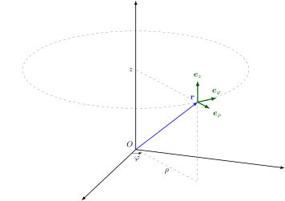
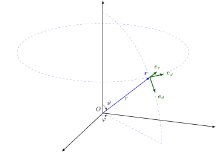

本文規定了 **NCKUME wiki** 中數學符號的推薦寫法，並給出了一些應用範例。

本文參考了 [CNS80000-2](https://www.cnsonline.com.tw/?node=detail&generalno=80000-2&locale=zh_TW) 和 [ISO 80000-2:2019](https://www.iso.org/standard/64973.html) 修訂，故基本與國內通行教材的符號體系相容。
<!-- OI wiki使用[GB/T 3102.11-1993](https://openstd.samr.gov.cn/bzgk/gb/newGbInfo?hcno=3DE79450D562E62D41CB6E79FF411054) 和ISO 8000-2:2019，在這個層次的規定是相容的。 -->
符號的 LaTeX 寫法請參考 [本文章的原始程式碼](https://github.com/NCKUME-wiki/NCKUME-wiki/blob/master/docs/intro/symbol.md?plain=1)

## 數理邏輯

| 編號   | 符號，運算式                    | 意義，等同表述                          | 備註與示例                                                                                                                                                                                      |
| ---- | ------------------------- | -------------------------------- | ------------------------------------------------------------------------------------------------------------------------------------------------------------------------------------------ |
| n1.1 | $p \land q$               | $p$ 和 $q$ 的合取                    | $p$ 與 $q$.                                                                                                                                                                                 |
| n1.2 | $p \lor q$                | $p$ 和 $q$ 的析取                    | $p$ 或 $q$; 此處的 "或" 是包含的，即若 $p$，$q$ 中有一個為真陳述，則 $p \lor q$ 為真。                                                                                                                            |
| n1.3 | $\lnot p$                 | $p$ 的否定                          | 非 $p$.                                                                                                                                                                                     |
| n1.4 | $p \implies q$            | $p$ 蘊含 $q$; 若 $p$ 為真，則 $q$ 為真 | $q \impliedby p$ 和 $p \implies q$ 同義。                                                                                                                                                      |
| n1.5 | $p \iff q$                | $p$ 等價於 $q$                      | $(p \implies q) \land (q \implies p)$ 和 $p \iff q$ 同義。                                                                                                                                     |
| n1.6 | $(\forall~x \in A)~~p(x)$ | 對 $A$ 中所有的 $x$, 命題 $p(x)$ 均為真    | 如果從上下文中可以得知考慮的是哪個集合 $A$, 可以使用記號 $(\forall~x)~~p(x)$. $\forall$ 稱為全稱量詞。 $x \in A$ 的含義見 n2.1.                                                                                          |
| n1.7 | $(\exists~x \in A)~~p(x)$ | 存在一個屬於 $A$ 的 $x$ 使得 $p(x)$ 為真    | 如果從上下文中可以得知考慮的是哪個集合 $A$, 可以使用記號 $(\exists~x)~~p(x)$. $\exists$ 稱為存在量詞。 $x \in A$ 的含義見 n2.1. $(\exists!~x)~~p(x)$（唯一量詞）用來表示恰有一個 $x$ 使得 $p(x)$ 為真。 $\exists!$ 也可以寫作 $\exists^1$. |

## 集合論

| 編號    | 符號，運算式                                     | 意義，等同表述                         | 備註與示例                                                                                                                                                                                                                       |
| ----- | ------------------------------------------ | ------------------------------- | --------------------------------------------------------------------------------------------------------------------------------------------------------------------------------------------------------------------------- |
| n2.1  | $x \in A$                                  | $x$ 屬於 $A$，$x$ 是集合 $A$ 中的元素     | $A \ni x$ 和 $x \in A$ 同義。                                                                                                                                                                                                   |
| n2.2  | $y \notin A$                               | $y$ 不屬於 $A$，$y$ 不是集合 $A$ 中的元素   |                                                                                                                                                                                                                             |
| n2.3  | $\{x_1, x_2, \dots, x_n\}$                 | 含元素 $x_1, x_2, \dots, x_n$ 的集合  | 也可寫作 $\{x_i ~\vert~ i \in I\}$, 其中 $I$ 表示指標集。                                                                                                                                                                               |
| n2.4  | $\{x \in A ~\vert~ p(x)\}$                 | $A$ 中使命題 $p(x)$ 為真的所有元素組成的集合    | 例如 $\{x \in \textbf{R} ~\vert~ x \geq 5\}$; 如果從上下文中可以得知考慮的是哪個集合 $A$，可以使用符號 $\{x ~\vert~ p(x)\}$（如在只考慮實數集時可使用 $\{x ~\vert~ x \geq 5\}$） $\vert$ 也可以使用冒號替代，如 $\{x \in A : p(x)\}$.                                      |
| n2.5  | $\operatorname{card} A$; $\vert A\vert$ | $A$ 中的元素個數，$A$ 的基數              |                                                                                                                                                                                                                             |
| n2.6  | $\varnothing$                              | 空集                              | 不應使用 $\emptyset$.                                                                                                                                                                                                           |
| n2.7  | $B \subseteq A$                            | $B$ 包含於 $A$ 中，$B$ 是 $A$ 的子集     | $B$ 的每個元素都屬於 $A$. $\subset$ 也可用於該含義，但請參閱 n2.8 的說明。 $A \supseteq B$ 和 $B \subseteq A$ 同義。                                                                                                                              |
| n2.8  | $B \subset A$                              | $B$ 真包含於 $A$ 中，$B$ 是 $A$ 的真子集   | $B$ 的每個元素都屬於 $A$, 且 $A$ 中至少有一個元素不屬於 $B$. 若 $\subset$ 的含義取 n2.7, 則 n2.8 對應的符號應使用 $\subsetneq$. $A \supset B$ 與 $B \subset A$ 同義。                                                                                       |
| n2.9  | $A \cup B$                                 | $A$ 和 $B$ 的並集                   | $A \cup B := \{x ~\vert~ x \in A \lor x \in B\}$; $:=$ 的定義參見 n4.3                                                                                                                                                        |
| n2.10 | $A \cap B$                                 | $A$ 和 $B$ 的交集                   | $A \cap B := \{x ~\vert~ x \in A \land x \in B\}$; $:=$ 的定義參見 n4.3                                                                                                                                                       |
| n2.11 | $\displaystyle \bigcup\limits_{i=1}^n A_i$ | 集合 $A_1, A_2, \dots, A_n$ 的並集   | $\displaystyle \bigcup\limits_{i=1}^n A_i=A_1\cup A_2\cup \dots \cup A_n$; 也可使用 $\displaystyle \bigcup\nolimits_{i=1}^n$，$\displaystyle \bigcup\limits_{i\in I}$，$\displaystyle \bigcup\nolimits_{i\in I}$, 其中 $I$ 表示指標集 |
| n2.12 | $\displaystyle \bigcap\limits_{i=1}^n A_i$ | 集合 $A_1, A_2, \dots, A_n$ 的交集   | $\displaystyle \bigcap\limits_{i=1}^n A_i=A_1\cap A_2\cap \dots \cap A_n$; 也可使用 $\displaystyle \bigcap\nolimits_{i=1}^n$，$\displaystyle \bigcap\limits_{i\in I}$，$\displaystyle \bigcap\nolimits_{i\in I}$, 其中 $I$ 表示指標集 |
| n2.13 | $A \setminus B$                            | $A$ 和 $B$ 的差集                   | $A \setminus B = \{x ~\vert~ x \in A \land x \notin B\}$; 不應使用 $A - B$; 當 $B$ 是 $A$ 的子集時也可使用 $\complement_A B$, 如果從上下文中可以得知考慮的是哪個集合 $A$，則 $A$ 可以省略。 不引起歧義的情況下也可使用 $\overline{B}$ 表示集合 $B$ 的補集。                     |
| n2.14 | $(a, b)$                                   | 有序數對 $a$，$b$; 有序偶 $a$，$b$    | $(a, b) = (c, d)$ 當且僅當 $a = c$ 且 $b = d$.                                                                                                                                                                                   |
| n2.15 | $(a_1, a_2, \dots, a_n)$                   | 有序 $n$ 元組                       | 參見 n2.14.                                                                                                                                                                                                                   |
| n2.16 | $A \times B$                               | 集合 $A$ 和 $B$ 的笛卡爾積              | $A \times B = \{(x, y) ~\vert~ x \in A \land y \in B\}$.                                                                                                                                                                    |
| n2.17 | $\displaystyle \prod\limits_{i=1}^{n} A_i$ | 集合 $A_1, A_2, \dots, A_n$ 的笛卡爾積 | $\displaystyle \prod\limits_{i=1}^{n} A_i=\{(x_1, x_2, \dots, x_n) ~\vert~ x_1 \in A_1, x_2 \in A_2, \dots, x_n \in A_n\}$; $A \times A \times \dots \times A$ 記為 $A^n$, 其中 $n$ 是乘積中的因數數。                                |
| n2.18 | $\mathrm{id}_A$                            | $A\times A$ 的對角集                | $\mathrm{id}_A=\{(x, x)~\vert~x\in A\}$; 如果從上下文中可以得知考慮的是哪個集合 $A$, 則 $A$ 可以省略。                                                                                                                                            |

## 標準數集和區間

| 編號    | 符號，運算式       | 意義，等同表述           | 備註與示例                                                                                                                                                                                       |
| ----- | ------------ | ----------------- | ------------------------------------------------------------------------------------------------------------------------------------------------------------------------------------------- |
| n3.1  | $\mathbf{N}$ | 自然數集              | $\mathbf{N} = \{0, 1, 2, 3, \dots\}$; $\mathbf{N}^* = \mathbf{N}_+ = \{1, 2, 3, \dots\}$; 可用如下方式添加其他限制：$\mathbf{N}_{> 5} = \{n \in \mathbf{N} ~\vert~ n > 5\}$; 也可使用 $\mathbb{N}$. |
| n3.2  | $\mathbf{Z}$ | 整數集               | $\mathbf{Z}^* = \mathbf{Z}_+ = \{n \in \mathbf{Z} ~\vert~ n \ne 0\}$; 可用如下方式添加其他限制：$\mathbf{Z}_{> -3} = \{n \in \mathbf{Z} ~\vert~ n > -3\}$; 也可使用 $\mathbb{Z}$.                      |
| n3.3  | $\mathbf{Q}$ | 有理數集              | $\mathbf{Q}^* = \mathbf{Q}_+ = \{r \in \mathbf{Q} ~\vert~ r \ne 0\}$; 可用如下方式添加其他限制：$\mathbf{Q}_{< 0} = \{r \in \mathbf{Q} ~\vert~ r < 0\}$; 也可使用 $\mathbb{Q}$.                        |
| n3.4  | $\mathbf{R}$ | 實數集               | $\mathbf{R}^* = \mathbf{R}_+ = \{x \in \mathbf{R} ~\vert~ x \ne 0\}$; 可用如下方式添加其他限制：$\mathbf{R}_{> 0} = \{x \in \mathbf{R} ~\vert~ x > 0\}$; 也可使用 $\mathbb{R}$.                        |
| n3.5  | $\mathbf{C}$ | 複數集               | $\mathbf{C}^* = \mathbf{C}_+ = \{z \in \mathbf{C} ~\vert~ z \ne 0\}$; 也可使用 $\mathbb{C}$.                                                                                                 |
| n3.6  | $\mathbf{P}$ | （正）素數集            | $\mathbf{P} = \{2, 3, 5, 7, 11, 13, 17, \dots\}$; 也可使用 $\mathbb{P}$.                                                                                                                     |
| n3.7  | $[a, b]$     | $a$ 到 $b$ 的閉區間    | $[a, b] = \{x \in \mathbf{R} ~\vert~ a \leq x \leq b\}$.                                                                                                                                    |
| n3.8  | $(a, b]$     | $a$ 到 $b$ 的左開右閉區間 | $(a, b] = \{x \in \mathbf{R} ~\vert~ a < x \leq b\}$; $(-\infty, b] = \{x \in \mathbf{R} ~\vert~ x \leq b\}$.                                                                            |
| n3.9  | $[a, b)$     | $a$ 到 $b$ 的左閉右開區間 | $[a, b) = \{x \in \mathbf{R} ~\vert~ a \leq x < b\}$; $[a, +\infty) = \{x \in \mathbf{R} ~\vert~ a \leq x\}$.                                                                            |
| n3.10 | $(a, b)$     | $a$ 到 $b$ 的開區間    | $(a, b) = \{x \in \mathbf{R} ~\vert~ a < x < b\}$; $(-\infty, b) = \{x \in \mathbf{R} ~\vert~ x < b\}$; $(a, +\infty) = \{x \in \mathbf{R} ~\vert~ a < x\}$.                          |

## 關係

| 編號    | 符號，運算式               | 意義，等同表述            | 備註與示例                                                                                                |
| ----- | -------------------- | ------------------ | ---------------------------------------------------------------------------------------------------- |
| n4.1  | $a = b$              | $a$ 等於 $b$         | $\equiv$ 用於強調某等式是恒等式 該符號的另一個含義參見 n4.18.                                                           |
| n4.2  | $a \ne b$            | $a$ 不等於 $b$        |                                                                                                      |
| n4.3  | $a := b$             | $a$ 定義為 $b$        | 參見 n2.9, n2.10                                                                                       |
| n4.4  | $a \approx b$        | $a$ 約等於 $b$        | 不排除相等。                                                                                               |
| n4.5  | $a \simeq b$         | $a$ 漸進等於 $b$       | 例如： 當 $x\to a$ 時，$\dfrac{1}{\sin(x-a)} \simeq \dfrac{1}{x-a}$; $x \to a$ 的含義參見 n4.15.          |
| n4.6  | $a \propto b$        | $a$ 與 $b$ 成正比      | 也可使用 $a \sim b$. $\sim$ 也用於表示等價關係。                                                                |
| n4.7  | $M \cong N$          | $M$ 與 $N$ 全等       | 當 $M$ 和 $N$ 是點集（幾何圖形）時。 該符號也用於表示代數結構的同構。                                                          |
| n4.8  | $a < b$              | $a$ 小於 $b$         |                                                                                                      |
| n4.9  | $b > a$              | $b$ 大於 $a$         |                                                                                                      |
| n4.10 | $a \leq b$           | $a$ 小於等於 $b$       |                                                                                                      |
| n4.11 | $b \geq a$           | $b$ 大於等於 $a$       |                                                                                                      |
| n4.12 | $a \ll b$            | $a$ 遠小於 $b$        |                                                                                                      |
| n4.13 | $b \gg a$            | $b$ 遠大於 $a$        |                                                                                                      |
| n4.14 | $\infty$             | 無窮大                | 該符號 **不** 是數位。 也可以使用 $+\infty$，$-\infty$.                                                         |
| n4.15 | $x \to a$            | $x$ 趨近於 $a$        | 一般出現在極限運算式中。 $a$ 也可以為 $\infty$，$+\infty$，$-\infty$.                                               |
| n4.16 | $m \mid n$           | $m$ 整除 $n$         | 對整數 $m$，$n$: $(\exists~k \in \mathbf{Z})~~m\cdot k = n$.                                          |
| n4.17 | $m \perp n$          | $m$ 與 $n$ 互質       | 對整數 $m$，$n$: $(\nexists~k \in \mathbf{Z}_{>1})~~(k \mid m) \land (k \mid n)$; 該符號的另一種用法參見 n5.2 |
| n4.18 | $n \equiv k \pmod m$ | $n$ 模 $m$ 與 $k$ 同餘 | 對整數 $n$，$k$，$m$: $m \mid (n - k)$; 不要與 n4.1 中提到的相混淆。                                           |

## 初等幾何學

| 編號   | 符號，運算式                         | 意義，等同表述                             | 備註與示例                           |
| ---- | ------------------------------ | ----------------------------------- | ------------------------------- |
| n5.1 | $\parallel$                    | 平行                                  |                                 |
| n5.2 | $\perp$                        | 垂直                                  | 該符號的另一種用法參見 n4.17               |
| n5.3 | $\angle$                       | （平面）角                               |                                 |
| n5.4 | $\overline{\mathrm{AB}}$       | 線段 $\mathrm{AB}$                    |                                 |
| n5.5 | $\overrightarrow{\mathrm{AB}}$ | 有向線段 $\mathrm{AB}$                  |                                 |
| n5.6 | $d(\mathrm{A}, \mathrm{B})$    | 點 $\mathrm{A}$ 和 $\mathrm{B}$ 之間的距離 | 即 $\overline{\mathrm{AB}}$ 的長度。 |

## 運算子

| 編號    | 符號，運算式                                                      | 意義，等同表述                               | 備註與示例                                                                                                                                              |
| ----- | ----------------------------------------------------------- | ------------------------------------- | -------------------------------------------------------------------------------------------------------------------------------------------------- |
| n6.1  | $a + b$                                                     | $a$ 加 $b$                             |                                                                                                                                                    |
| n6.2  | $a - b$                                                     | $a$ 減 $b$                             |                                                                                                                                                    |
| n6.3  | $a \pm b$                                                   | $a$ 加或減 $b$                           |                                                                                                                                                    |
| n6.4  | $a \mp b$                                                   | $a$ 減或加 $b$                           | $-(a \pm b) = -a \mp b$.                                                                                                                           |
| n6.5  | $a \cdot b$; $a \times b$; $ab$                       | $a$ 乘 $b$                             | 若出現小數點，則應只使用 $\times$; 部分用例參見 n2.16, n2.17, n14.11, n14.12                                                                                      |
| n6.6  | $\dfrac{a}{b}$; $a/b$; $a:b$                          | $a$ 除以 $b$                            | $\dfrac{a}{b}=a\cdot b^{-1}$; 可用 $:$ 表示同一量綱的數值的比率。 不應使用 $÷$.                                                                                 |
| n6.7  | $\displaystyle \sum\limits_{i=1}^n a_i$                     | $a_1 + a_2 + \dots + a_n$             | 也可使用 $\displaystyle \sum\nolimits_{i=1}^n a_i$，$\displaystyle \sum\limits_i a_i$，$\displaystyle \sum\nolimits_i a_i$，$\displaystyle \sum a_i$.     |
| n6.8  | $\displaystyle \prod\limits_{i=1}^n a_i$                    | $a_1 \cdot a_2 \cdot \dots \cdot a_n$ | 也可使用 $\displaystyle \prod\nolimits_{i=1}^n a_i$，$\displaystyle \prod\limits_i a_i$，$\displaystyle \prod\nolimits_i a_i$，$\displaystyle \prod a_i$. |
| n6.9  | $a^p$                                                       | $a$ 的 $p$ 次冪                          |                                                                                                                                                    |
| n6.10 | $a^{1/2}$; $\sqrt{a}$                                    | $a$ 的 $1/2$ 次方，$a$ 的平方根               | 應避免使用 $\sqrt{}a$.                                                                                                                                  |
| n6.11 | $a^{1/n}$; $\sqrt[n]{a}$                                 | $a$ 的 $1/n$ 次冪，$a$ 的 $n$ 次根           | 應避免使用 $\sqrt[n]{}a$.                                                                                                                               |
| n6.12 | $\bar{x}$; $\bar{x}_a$                                   | $x$ 的算數均值                             | 其他均值有： 調和均值 $\bar{x}_h$; 幾何均值 $\bar{x}_g$; 二次均值/均方根 $\bar{x}_q$ 或 $\bar{x}_{rms}$. $\bar{x}$ 也用於表示複數 $x$ 的共軛，參見 n11.6.                 |
| n6.13 | $\operatorname{sgn} a$                                      | $a$ 的符號函數                             | 對實數 $a$: $\operatorname{sgn} a=1\quad (a>0)$; $\operatorname{sgn} a=-1\quad (a<0)$; $\operatorname{sgn} 0=0$; 參見 n11.7.                |
| n6.14 | $\inf M$                                                    | $M$ 的下確界                              | 小於等於非空集合 $M$ 中元素的最大上界。                                                                                                                             |
| n6.15 | $\sup M$                                                    | $M$ 的上確界                              | 大於等於非空集合 $M$ 中元素的最小下界。                                                                                                                             |
| n6.16 | $\lvert a\rvert$                                            | $a$ 的絕對值                              | 也可使用 $\operatorname{abs} a$.                                                                                                                       |
| n6.17 | $\lfloor a\rfloor$                                          | 向下取整 小於等於實數 $a$ 的最大整數              | 例如： $\lfloor 2.4\rfloor = 2$; $\lfloor -2.4\rfloor = -3$.                                                                                    |
| n6.18 | $\lceil a\rceil$                                            | 向上取整 大於等於實數 $a$ 的最小整數              | 例如： $\lceil 2.4\rceil = 3$; $\lceil -2.4\rceil = -2$.                                                                                        |
| n6.19 | $\min(a, b)$; $\min\{a, b\}$                             | $a$ 和 $b$ 的最小值                        | 可推廣到有限集中。 要表示無限集中的最小值建議使用 $\inf$, 參見 n6.14                                                                                                      |
| n6.20 | $\max(a, b)$; $\max\{a, b\}$                             | $a$ 和 $b$ 的最大值                        | 可推廣到有限集中。 要表示無限集中的最大值建議使用 $\sup$, 參見 n6.15                                                                                                      |
| n6.21 | $n \bmod m$                                                 | $n$ 模 $m$ 的餘數                         | 對正整數 $n$，$m$: $(\exists~q\in\mathbf{N}, r\in[0, m))~~n=qm+r$; 其中 $r=n \bmod m$.                                                              |
| n6.22 | $\gcd(a, b)$; $\gcd\{a, b\}$                             | 整數 $a$ 和 $b$ 的最大公因數                   | 可推廣到有限集中。不引起歧義的情況下可寫為 $(a, b)$.                                                                                                                    |
| n6.23 | $\operatorname{lcm}(a, b)$; $\operatorname{lcm}\{a, b\}$ | 整數 $a$ 和 $b$ 的最小公倍數                   | 可推廣到有限集中。不引起歧義的情況下可寫為 $[a, b]$; $(a, b)[a, b]=\lvert ab\rvert$.                                                                                 |

## 組合數學

本節中的 $n$ 和 $k$ 是自然數，$a$ 是複數，且 $k\leq n$.

| 編號   | 符號，運算式                     | 意義，等同表述        | 備註與示例                                                                                                                                         |
| ---- | -------------------------- | -------------- | --------------------------------------------------------------------------------------------------------------------------------------------- |
| n7.1 | $n!$                       | 階乘             | $n!=\prod_{k=1}^n k=1\cdot 2\cdot 3\cdot \dots \cdot n\quad (n>0)$; $0!=1$.                                                                |
| n7.2 | $a^{\underline{k}}$        | 下降階乘冪          | $a^{\underline{k}}=a\cdot(a-1)\cdot \dots \cdot(a-k+1)\quad (k>0)$; $a^{\underline{0}}=1$; $n^{\underline{k}}=\dfrac{n!}{(n-k)!}$.      |
| n7.3 | $a^{\overline{k}}$         | 上升階乘冪          | $a^{\overline{k}}=a\cdot(a+1)\cdot \dots \cdot(a+k-1)\quad (k>0)$; $a^{\overline{0}}=1$; $n^{\overline{k}}=\dfrac{(n+k-1)!}{(n-1)!}$.   |
| n7.4 | $\dbinom{n}{k}$            | 組合數            | $\dbinom{n}{k}=\dfrac{n!}{k!(n-k)!}$.                                                                                                         |
| n7.5 | $\displaystyle{n\brack k}$ | 第一類 Stirling 數 | $\displaystyle{n+1\brack k}=n{n\brack k}+{n\brack k-1}$; $\displaystyle x^{\overline{n}}=\sum_{k=0}^n{n\brack k}x^k$.                      |
| n7.6 | $\displaystyle{n\brace k}$ | 第二類 Stirling 數 | $\displaystyle{n\brace k}=\frac{1}{k!}\sum_{i=0}^k(-1)^i\binom{k}{i}(k-i)^n$; $\displaystyle\sum_{k=0}^n{n\brace k}x^{\underline{k}}=x^n$. |

## 函數

| 編號    | 符號，運算式                                                                    | 意義，等同表述                                                    | 備註與示例                                                                                                                                                                                                                                                                                                                                                       |
| ----- | ------------------------------------------------------------------------- | ---------------------------------------------------------- | ----------------------------------------------------------------------------------------------------------------------------------------------------------------------------------------------------------------------------------------------------------------------------------------------------------------------------------------------------------- |
| n8.1  | $f$                                                                       | 函數                                                         |                                                                                                                                                                                                                                                                                                                                                             |
| n8.2  | $f(x)$，$f(x_1, \dots, x_n)$                                               | 函數 $f$ 在 $x$ 處的值 函數 $f$ 在 $(x_1, \dots, x_n)$ 處的值       |                                                                                                                                                                                                                                                                                                                                                             |
| n8.3  | $\operatorname{dom} f$                                                    | $f$ 的定義域                                                   | 也可使用 $\mathrm{D}(f)$.                                                                                                                                                                                                                                                                                                                                       |
| n8.4  | $\operatorname{ran} f$                                                    | $f$ 的值域                                                    | 也可使用 $\mathrm{R}(f)$.                                                                                                                                                                                                                                                                                                                                       |
| n8.5  | $f:A\to B$                                                                | $f$ 是 $A$ 到 $B$ 的映射                                        | $\operatorname{dom} f=A$ 且 $(\forall~x \in\operatorname{dom} f)~~ f(x) \in B$.                                                                                                                                                                                                                                                                              |
| n8.6  | $x\mapsto T(x), x\in A$                                                   | 將所有 $x\in A$ 映射到 $T(x)$ 的函數                                | $T(x)$ 僅用於定義，用來表示某個參數為 $x\in A$ 的某個函數值。若這個函數為 $f$, 則對所有 $x\in A$ 均有 $f(x)=T(x)$. 因此 $T(x)$ 通常用來定義函數 $f$. 例如： $x\mapsto 3x^2y, x\in[0, 2]$; 這是由 $3x^2y$ 定義的一個關於 $x$ 的二次函數。若未引入函數符號，則用 $3x^2y$ 表示該函數                                                                                                                                                 |
| n8.7  | $f^{-1}$                                                                  | $f$ 的反函數                                                   | 函數 $f$ 的反函數 $f^{-1}$ 有定義當且僅當 $f$ 是單射。 若 $f$ 是單射，則 $\operatorname{dom}\left(f^{-1}\right) = \operatorname{ran} f$，$\operatorname{ran}\left(f^{-1}\right) = \operatorname{dom} f$, 且 $(\forall~x\in\operatorname{dom} f)~~f^{-1}(f(x)) = x$. 不要與函數的倒數 $f(x)^{-1}$ 混淆。                                                                                   |
| n8.8  | $g\circ f$                                                                | $f$ 和 $g$ 的複合函數                                            | $(g\circ f)(x)=g(f(x))$.                                                                                                                                                                                                                                                                                                                                    |
| n8.9  | $f:x\mapsto y$                                                            | $f(x)=y$，$f$ 將 $x$ 映射到 $y$                                 |                                                                                                                                                                                                                                                                                                                                                             |
| n8.10 | $f\vert_a^b$; $f(\dots, u, \dots)\vert_{u=a}^{u=b}$                    | $f(b)-f(a)$; $f(\dots, b, \dots)-f(\dots, a, \dots)$    | 主要用於定積分的計算中。                                                                                                                                                                                                                                                                                                                                                |
| n8.11 | $\displaystyle \lim\limits_{x\to a}f(x)$; $\lim\nolimits_{x\to a}f(x)$ | 當 $x$ 趨近于 $a$ 時 $f(x)$ 的極限                                 | $\lim\nolimits_{x\to a}f(x)=b$ 可以寫成 $f(x)\to b\quad (x \to a)$. 右極限和左極限的符號分別為 $\lim\nolimits_{x\to a+}f(x)$ 和 $\lim\nolimits_{x\to a-}f(x)$.                                                                                                                                                                                                          |
| n8.12 | $f(x) = O(g(x))$                                                          | $\lvert f(x)/g(x)\rvert$ 在上下文隱含的限制中有上界，$f(x)$ 的階不高於 $g(x)$ | 當 $f/g$ 與 $g/f$ 均有界時稱 $f$ 與 $g$ 是同階的。 使用符號 "$=$" 是出於歷史原因，其在此處不表示等價，因為不滿足傳遞性。 例如： $\sin x=O(x)\quad (x\to 0)$.                                                                                                                                                                                                                                      |
| n8.13 | $f(x) = o(g(x))$                                                          | 在上下文隱含的限制中有 $f(x)/g(x)\to 0$，$f(x)$ 的階高於 $g(x)$            | 使用符號 "$=$" 是出於歷史原因，其在此處不表示等價，因為不滿足傳遞性。 例如： $\cos x=1+o(x)\quad (x\to 0)$.                                                                                                                                                                                                                                                                             |
| n8.14 | $\Delta f$                                                                | $f$ 的有限增量                                                  | 上下文隱含的兩函數值的差分。例如： $\Delta x=x_2-x_1$; $\Delta f(x)=f(x_2)-f(x_1)$.                                                                                                                                                                                                                                                                                    |
| n8.15 | $\dfrac{\mathrm{d}f}{\mathrm{d}x}$; $f'$                               | $f$ 對 $x$ 的導（函）數                                           | 僅用於一元函數。 可以顯式指明引數，如 $\dfrac{\mathrm{d}f(x)}{\mathrm{d}x}$，$f'(x)$.                                                                                                                                                                                                                                                                                      |
| n8.16 | $\left(\dfrac{\mathrm{d}f}{\mathrm{d}x}\right)_{x=a}$; $f'(a)$         | $f$ 在 $a$ 處的導（函）數值                                         | 參見 n8.15                                                                                                                                                                                                                                                                                                                                                    |
| n8.17 | $\dfrac{\mathrm{d}^n f}{\mathrm{d}x^n}$; $f^{(n)}$                     | $f$ 對 $x$ 的 $n$ 階導（函）數                                     | 僅用於一元函數。 可以顯式指明引數，如 $\dfrac{\mathrm{d}^n f(x)}{\mathrm{d}x^n}$，$f^{(n)}(x)$. 可用 $f''$ 和 $f'''$ 分別表示 $f^{(2)}$ 和 $f^{(3)}$.                                                                                                                                                                                                                           |
| n8.18 | $\dfrac{\partial f}{\partial x}$; $f_x$                                | $f$ 對 $x$ 的偏導數                                             | 僅用於多元函數。 可以顯式指明引數，如 $\dfrac{\partial f(x, y, \dots)}{\partial x}$，$f_x(x, y, \dots)$. 可以擴展到高階，如 $f_{xx}=\dfrac{\partial^2 f}{\partial x^2}=\dfrac{\partial}{\partial x}\left(\dfrac{\partial f}{\partial x}\right)$; $f_{xy}=\dfrac{\partial^2 f}{\partial y\partial x}=\dfrac{\partial}{\partial y}\left(\dfrac{\partial f}{\partial x}\right)$. |
| n8.19 | $\dfrac{\partial(f_1, \dots, f_m)}{\partial(x_1, \dots, x_n)}$            | Jacobi 矩陣                                                  | *參見*[^n8.19-ref1]                                                                                                                                                                                                                                                                                                                                           |
| n8.20 | $\mathrm{d}f$                                                             | $f$ 的全微分                                                   | $\mathrm{d}f(x, y, \dots)=\dfrac{\partial f}{\partial x}\mathrm{d}x+\dfrac{\partial f}{\partial y}\mathrm{d}y+\dots$.                                                                                                                                                                                                                                       |
| n8.21 | $\delta f$                                                                | $f$ 的（無窮小）變分                                               |                                                                                                                                                                                                                                                                                                                                                             |
| n8.22 | $\displaystyle \int f(x)\mathrm{d}x$                                      | $f$ 的不定積分                                                  |                                                                                                                                                                                                                                                                                                                                                             |
| n8.23 | $\displaystyle \int\limits_a^b f(x)\mathrm{d}x$                           | $f$ 從 $a$ 到 $b$ 的定積分                                       | 也可使用 $\displaystyle \int\nolimits_a^b f(x)\mathrm{d}x$; 定積分還可以定義在更一般的域上。如 $\displaystyle\int\limits_C$，$\displaystyle\int\limits_S$，$\displaystyle\int\limits_V$，$\displaystyle\oint$, 分別表示在曲線 $C$, 曲面 $S$, 三維區域 $V$, 和閉曲線或曲面上的定積分。 多重積分可寫成 $\displaystyle\iint$，$\displaystyle\iiint$ 等。                                                             |
| n8.24 | $f*g$                                                                     | 函數 $f$ 和 $g$ 的卷積                                           | $\displaystyle (f*g)(x)=\int\limits_{-\infty}^{\infty}f(y)g(x-y)\mathrm{d}y$.                                                                                                                                                                                                                                                                               |

[^n8.19-ref1]: $\dfrac{\partial(f_1, \dots, f_m)}{\partial(x_1, \dots, x_n)}=\begin{pmatrix}\dfrac{\partial f_1}{\partial x_1}&\cdots&\dfrac{\partial f_1}{\partial x_n}\\\vdots&\ddots&\vdots\\\dfrac{\partial f_m}{\partial x_1}&\cdots&\dfrac{\partial f_m}{\partial x_n}\end{pmatrix}$; 矩陣的定義參見 n12.1

## 指數和對數函數

$x$ 可以是複數。

| 編號   | 符號，運算式                      | 意義，等同表述                      | 備註與示例                                                                                                          |
| ---- | --------------------------- | ---------------------------- | -------------------------------------------------------------------------------------------------------------- |
| n9.1 | $\mathrm{e}$                | 自然對數的底                       | $\displaystyle \mathrm{e}=\lim\limits_{n\to\infty}\left(1+\frac{1}{n}\right)^n=2.718~281~8\dots$; 不要寫成 $e$. |
| n9.2 | $a^x$                       | $x$ 的指數函數（以 $a$ 為底）          | 參見 n6.9.                                                                                                       |
| n9.3 | $\mathrm{e}^x$; $\exp x$ | $x$ 的指數函數（以 $\mathrm{e}$ 為底） |                                                                                                                |
| n9.4 | $\log_a x$                  | $x$ 的以 $a$ 為底的對數             | 當底數不需要指定的時候可以使用 $\log x$. 不應用 $\log x$ 替換 $\ln x$，$\lg x$，$\operatorname{lb} x$ 中的任意一個。                     |
| n9.5 | $\ln x$                     | $x$ 的自然對數                    | $\ln x = \log_{\mathrm{e}} x$; 參見 n9.4.                                                                     |
| n9.6 | $\lg x$                     | $x$ 的常用對數                    | $\lg x = \log_{10} x$; 參見 n9.4.                                                                             |
| n9.7 | $\operatorname{lb} x$       | $x$ 的以 $2$ 為底的對數             | $\operatorname{lb} x = \log_2 x$; 參見 n9.4.                                                                  |

## 三角函數和雙曲函數

| 編號     | 符號，運算式                    | 意義，等同表述    | 備註與示例                                                                                                                                                    |
| ------ | ------------------------- | ---------- | -------------------------------------------------------------------------------------------------------------------------------------------------------- |
| n10.1  | $\pi$                     | 圓周率        | $\pi = 3.141~592~6\dots$.                                                                                                                                |
| n10.2  | $\sin x$                  | $x$ 的正弦    | $\sin x=\dfrac{\mathrm{e}^{\mathrm{i}x}-\mathrm{e}^{-\mathrm{i}x}}{2\mathrm{i}}$; $(\sin x)^n$，$(\cos x)^n$($n\geq 2$) 等通常寫為 $\sin^n x$，$\cos^n x$ 等。 |
| n10.3  | $\cos x$                  | $x$ 的余弦    | $\cos x = \sin(x + \pi/2)$.                                                                                                                              |
| n10.4  | $\tan x$                  | $x$ 的正切    | $\tan x = \sin x/\cos x$; 不可使用 $\operatorname{tg} x$.                                                                                                 |
| n10.5  | $\cot x$                  | $x$ 的餘切    | $\cot x = 1/\tan x$; 不可使用 $\operatorname{ctg} x$.                                                                                                     |
| n10.6  | $\sec x$                  | $x$ 的正割    | $\sec x = 1/\cos x$.                                                                                                                                     |
| n10.7  | $\csc x$                  | $x$ 的余割    | $\csc x = 1/\sin x$; 不可使用 $\operatorname{cosec} x$.                                                                                                   |
| n10.8  | $\arcsin x$               | $x$ 的反正弦   | $y = \arcsin x \iff x = \sin y\quad (-\pi/2 \leq y \leq \pi/2)$.                                                                                         |
| n10.9  | $\arccos x$               | $x$ 的反余弦   | $y = \arccos x \iff x = \cos y\quad (0 \leq y \leq \pi)$.                                                                                                |
| n10.10 | $\arctan x$               | $x$ 反正切    | $y = \arctan x \iff x = \tan y\quad (-\pi/2 \leq y \leq \pi/2)$; 不可使用 $\operatorname{arctg} x$.                                                       |
| n10.11 | $\operatorname{arccot} x$ | $x$ 反餘切    | $y = \operatorname{arccot} x \iff x = \cot y\quad (0 \leq y \leq \pi)$; 不可使用 $\operatorname{arcctg} x$.                                               |
| n10.12 | $\operatorname{arcsec} x$ | $x$ 反正割    | $y = \operatorname{arcsec} x \iff x = \sec y\quad (0\leq y \leq \pi, y\ne \pi/2)$.                                                                       |
| n10.13 | $\operatorname{arccsc} x$ | $x$ 的反余割   | $y = \operatorname{arccsc} x \iff x = \csc y\quad (-\pi/2 \leq y \leq \pi/2, y\ne 0)$; 不可使用 $\operatorname{arccosec} x$.                              |
| n10.14 | $\sinh x$                 | $x$ 的雙曲正弦  | $\sinh x=\dfrac{\mathrm{e}^x-\mathrm{e}^{-x}}{2}$; 不可使用 $\operatorname{sh} x$.                                                                        |
| n10.15 | $\cosh x$                 | $x$ 的雙曲余弦  | $\cosh^2 x = \sinh^2 x + 1$; 不可使用 $\operatorname{ch} x$.                                                                                              |
| n10.16 | $\tanh x$                 | $x$ 的雙曲正切  | $\tanh x = \sinh x/\cosh x$; 不可使用 $\operatorname{th} x$.                                                                                              |
| n10.17 | $\coth x$                 | $x$ 的雙曲餘切  | $\coth x = 1/\tanh x$.                                                                                                                                   |
| n10.18 | $\operatorname{sech} x$   | $x$ 的雙曲正割  | $\operatorname{sech} x = 1/\cosh x$.                                                                                                                     |
| n10.19 | $\operatorname{csch} x$   | $x$ 的雙曲余割  | $\operatorname{csch} x = 1/\sinh x$; 不可使用 $\operatorname{cosech} x$.                                                                                  |
| n10.20 | $\operatorname{arsinh} x$ | $x$ 的反雙曲正弦 | $y = \operatorname{arsinh} x \iff x = \sinh y$; 不可使用 $\operatorname{arsh} x$.                                                                         |
| n10.21 | $\operatorname{arcosh} x$ | $x$ 的反雙曲余弦 | $y = \operatorname{arcosh} x \iff x = \cosh y\quad (y \geq 0)$; 不可使用 $\operatorname{arch} x$.                                                         |
| n10.22 | $\operatorname{artanh} x$ | $x$ 的反雙曲正切 | $y = \operatorname{artanh} x \iff x = \tanh y$; 不可使用 $\operatorname{arth} x$.                                                                         |
| n10.23 | $\operatorname{arcoth} x$ | $x$ 的反雙曲餘切 | $y = \operatorname{arcoth} x \iff x = \coth y\quad (y \ne 0)$.                                                                                           |
| n10.24 | $\operatorname{arsech} x$ | $x$ 的反雙曲正割 | $y = \operatorname{arsech} x \iff x = \operatorname{sech} y\quad (y \geq 0)$.                                                                            |
| n10.25 | $\operatorname{arcsch} x$ | $x$ 的反雙曲余割 | $y = \operatorname{arcsch} x \iff x = \operatorname{csch} y\quad (y \geq 0)$; 不可使用 $\operatorname{arcosech} x$.                                       |

## 複數

| 編號    | 符號，運算式                 | 意義，等同表述    | 備註與示例                                                                                                                                                                                                  |
| ----- | ---------------------- | ---------- | ------------------------------------------------------------------------------------------------------------------------------------------------------------------------------------------------------ |
| n11.1 | $\mathrm{i}$           | 虛數單位       | $\mathrm{i}^2 = -1$; 不可使用 $i$ 或 `i`                                                                                                                                                                 |
| n11.2 | $\operatorname{Re} z$  | $z$ 的實部    | 參見 n11.3.                                                                                                                                                                                              |
| n11.3 | $\operatorname{Im} z$  | $z$ 的虛部    | 若 $z = x + \mathrm{i} y\quad (x, y\in\mathbf{R})$, 則 $x = \operatorname{Re} z$，$y = \operatorname{Im} z$.                                                                                              |
| n11.4 | $\lvert z\rvert$       | $z$ 的模     | $\lvert z\rvert=\sqrt{(\operatorname{Re} z)^2+(\operatorname{Im} z)^2}$.                                                                                                                               |
| n11.5 | $\arg z$               | $z$ 的輻角    | 若 $z = r \mathrm{e}^{\mathrm{i}\varphi}$, 其中 $r = \lvert z\rvert$ 且 $-\pi < \varphi \leq \pi$, 則 $\varphi = \arg z$. $\operatorname{Re} z = r \cos \varphi$，$\operatorname{Im} z = r \sin \varphi$. |
| n11.6 | $\bar{z}$; $z^*$    | $z$ 的複共軛   | $\bar{z}=\operatorname{Re}z-\mathrm{i}\operatorname{Im}z$.                                                                                                                                             |
| n11.7 | $\operatorname{sgn} z$ | $z$ 的單位模函數 | $\operatorname{sgn} z =z / \lvert z\rvert = \exp(\mathrm{i} \arg z)\quad (z \ne 0)$; $\operatorname{sgn} 0 = 0$; 參見 n6.13.                                                                       |

## 矩陣

| 編號     | 符號，運算式                             | 意義，等同表述             | 備註與示例                                                                                         |
| ------ | ---------------------------------- | ------------------- | --------------------------------------------------------------------------------------------- |
| n12.1  | $A$; *參見*[^n12.1-ref1]          | $m\times n$ 型矩陣 $A$ | $a_{ij} = (A)_{ij}$; 也可使用 $A = (a_{ij})$. 其中 $m$ 為行數，$n$ 為列數 $m=n$ 時稱為方陣 可用方括號替代圓括號。 |
| n12.2  | $A + B$                            | 矩陣 $A$ 和 $B$ 的和     | $(A + B)_{ij} = (A)_{ij} + (B)_{ij}$; 矩陣 $A$ 和 $B$ 的行數和列數必須分別相同。                           |
| n12.3  | $x A$                              | 標量 $x$ 和矩陣 $A$ 的乘積  | $(x A)_{ij} = x (A)_{ij}$.                                                                    |
| n12.4  | $AB$                               | 矩陣 $A$ 和 $B$ 的乘積    | $\displaystyle(AB)_{ik} = \sum\limits_{j}(A)_{ij}(B)_{jk}$; 矩陣 $A$ 的列數必須等於矩陣 $B$ 的行數。      |
| n12.5  | $I$; $E$                        | 單位矩陣                | $(I)_{ik} = \delta_{ik}$; $\delta_{ik}$ 的定義參見 n14.9.                                       |
| n12.6  | $A^{-1}$                           | 方陣 $A$ 的逆           | $AA^{-1} = A^{-1}A = I\quad (\det A \ne 0)$. $\det A$ 的定義參見 n12.10.                        |
| n12.7  | $A^{\mathrm{T}}$; $A'$          | $A$ 的轉置矩陣           | $(A^{\mathrm{T}})_{ik} = (A)_{ki}$.                                                           |
| n12.8  | $\overline{A}$; $A^*$           | $A$ 的複共軛矩陣          | $\left(\overline{A}\right)_{ik}=\overline{(A)_{ik}}$.                                         |
| n12.9  | $A^{\mathrm{H}}$; $A^{\dagger}$ | $A$ 的 Hermite 共軛矩陣  | $A^{\mathrm{H}} = \left(\overline{A}\right)^{\mathrm{T}}$.                                    |
| n12.10 | $\det A$; *參見*[^n12.10-ref1]    | 方陣 $A$ 的行列式         | 也可使用 $\lvert A\rvert$.                                                                        |
| n12.11 | $\operatorname{rank}A$             | 矩陣 $A$ 的秩           |                                                                                               |
| n12.12 | $\operatorname{tr}A$               | 方陣 $A$ 的跡           | $\displaystyle\operatorname{tr}A=\sum\limits_{i}(A)_{ii}$.                                    |
| n12.13 | $\lVert A\rVert$                   | 矩陣 $A$ 的範數          | 滿足三角不等式：若 $A + B = C$, 則 $\lVert A\rVert+\lVert B\rVert \geq \lVert C\rVert$.                 |

[^n12.1-ref1]: $\begin{pmatrix}a_{11}&\cdots&a_{1n}\\\vdots&\ddots&\vdots\\a_{m1}&\cdots&a_{mn}\end{pmatrix}$

[^n12.10-ref1]: $\begin{vmatrix}a_{11}&\cdots&a_{1n}\\\vdots& &\vdots\\a_{n1}&\cdots&a_{nn}\end{vmatrix}$

## 坐標系

本節考慮三維空間中的一些坐標系。點 $\mathrm{O}$ 為坐標系的 **原點**。任意點 $\mathrm{P}$ 均由從原點 $\mathrm{O}$ 到點 $\mathrm{P}$ 的 **位置向量** 確定。

| 編號    | 座標                        | 位置向量和微分                                                                                                                                                                                                                      | 座標名   | 備註                                                                                                                                                                                                                                                   |
| ----- | ------------------------- | ---------------------------------------------------------------------------------------------------------------------------------------------------------------------------------------------------------------------------- | ----- | ---------------------------------------------------------------------------------------------------------------------------------------------------------------------------------------------------------------------------------------------------- |
| n13.1 | $x$，$y$，$z$               | $\boldsymbol{r} = x \boldsymbol{e}_x + y \boldsymbol{e}_y + z \boldsymbol{e}_z$; $\mathrm{d}\boldsymbol{r} = \mathrm{d}x~\boldsymbol{e}_x + \mathrm{d}y~\boldsymbol{e}_y + \mathrm{d}z~\boldsymbol{e}_z$                  | 笛卡爾座標 | 基向量 $\boldsymbol{e}_x$，$\boldsymbol{e}_y$，$\boldsymbol{e}_z$ 構成右手正交系，見圖 1 和圖 4。 基向量也可用 $\boldsymbol{e}_1$，$\boldsymbol{e}_2$，$\boldsymbol{e}_3$ 或 $\boldsymbol{i}$，$\boldsymbol{j}$，$\boldsymbol{k}$ 表示，座標也可用 $x_1$，$x_2$，$x_3$ 或 $i$，$j$，$k$ 表示。 |
| n13.2 | $\rho$，$\varphi$，$z$      | $\boldsymbol{r} = \rho~\boldsymbol{e}_{\rho} + z~\boldsymbol{e}_z$; $\mathrm{d}\boldsymbol{r} = \mathrm{d}\rho~\boldsymbol{e}_{\rho} +\rho~\mathrm{d}\varphi~\boldsymbol{e}_{\varphi} + \mathrm{d}z~\boldsymbol{e}_z$     | 柱座標   | $\boldsymbol{e}_{\rho}(\varphi)$，$\boldsymbol{e}_{\varphi}(\varphi)$，$\boldsymbol{e}_z$ 組成右手正交系，見圖 2。 若 $z = 0$, 則 $\rho$ 和 $\varphi$ 是平面上的極座標。                                                                                                   |
| n13.3 | $r$，$\vartheta$，$\varphi$ | $\boldsymbol{r} = r \boldsymbol{e}_r$; $\mathrm{d}\boldsymbol{r} = \mathrm{d}r~\boldsymbol{e}_r + r~\mathrm{d}\vartheta~\boldsymbol{e}_{\vartheta} + r~\sin\vartheta~\mathrm{\mathrm{d}}\varphi~\boldsymbol{e}_{\varphi}$ | 球座標   | $\boldsymbol{e}_r(\vartheta, \varphi)$，$\boldsymbol{e}_{\vartheta}(\vartheta, \varphi)$，$\boldsymbol{e}_{\varphi}(\varphi)$ 組成右手正交系，見圖 3。                                                                                                            |

如果不使用右手坐標系（見圖 4），而使用左手坐標系（見圖 5），則應在之前明確強調，以免符號誤用。

**圖 1** 右手笛卡爾坐標系

**圖 2** 右手柱坐標系

**圖 3** 右手球坐標系

**圖 4** 右手坐標系

**圖 5** 左手坐標系

## 標量和向量

本節中，基向量用 $\boldsymbol{e}_1$，$\boldsymbol{e}_2$，$\boldsymbol{e}_3$ 表示。本節中的許多概念都可以推廣到 $n$ 維空間。

標量和向量本身與坐標系的選擇無關，而向量的每個標量分量與坐標系的選擇有關。

對於基向量 $\boldsymbol{e}_1$，$\boldsymbol{e}_2$，$\boldsymbol{e}_3$, 每個向量 $\boldsymbol{a}$ 都可以表示為 $\boldsymbol{a}=a_1\boldsymbol{e}_1+a_2\boldsymbol{e}_2+a_3\boldsymbol{e}_3$, 其中 $a_1$，$a_2$ 和 $a_3$ 是唯一確定的標量值，將其稱為向量相對於該組基向量的 "座標"，$a_1\boldsymbol{e}_1$，$a_2\boldsymbol{e}_2$ 和 $a_3\boldsymbol{e}_3$ 稱為向量相對於該組基向量的分向量。

在本節中，只考慮普通空間的笛卡爾（正交）座標。笛卡爾座標用 $x$，$y$，$z$ 或 $a_1$，$a_2$，$a_3$ 或 $x_1$，$x_2$，$x_3$ 表示。

本節所有下標 $i$，$j$，$k$ 的範圍均為 $1$ 到 $3$.

| 編號     | 符號，運算式                                                                                                                | 意義，等同表述                                         | 備註與示例                                                                                                                                                                                                                                                                                                                                                                                                |
| ------ | --------------------------------------------------------------------------------------------------------------------- | ----------------------------------------------- | ---------------------------------------------------------------------------------------------------------------------------------------------------------------------------------------------------------------------------------------------------------------------------------------------------------------------------------------------------------------------------------------------------- |
| n14.1  | $\boldsymbol{a}$; $\vec{a}$                                                                                        | 向量 $\boldsymbol{a}$                             |                                                                                                                                                                                                                                                                                                                                                                                                      |
| n14.2  | $\boldsymbol{a} + \boldsymbol{b}$                                                                                     | 向量 $\boldsymbol{a}$ 和 $\boldsymbol{b}$ 的和       | $(\boldsymbol{a} + \boldsymbol{b})_i = a_i + b_i$.                                                                                                                                                                                                                                                                                                                                                   |
| n14.3  | $x\boldsymbol{a}$                                                                                                     | 標量 $x$ 與向量 $\boldsymbol{a}$ 的乘積                 | $(x\boldsymbol{a})_i = xa_i$.                                                                                                                                                                                                                                                                                                                                                                        |
| n14.4  | $\lvert \boldsymbol{a}\rvert$                                                                                         | 向量 $\boldsymbol{a}$ 的大小，向量 $\boldsymbol{a}$ 的範數 | $\lvert \boldsymbol{a}\rvert=\sqrt{a_x^2+a_y^2+a_z^2}$; 也可使用 $\lVert a\rVert$.                                                                                                                                                                                                                                                                                                                    |
| n14.5  | $\boldsymbol{0}$; $\vec{0}$                                                                                        | 零向量                                             | 零向量的大小為 $0$.                                                                                                                                                                                                                                                                                                                                                                                         |
| n14.6  | $\boldsymbol{e_a}$                                                                                                    | $\boldsymbol{a}$ 方向的單位向量                        | $\boldsymbol{e_a} = \boldsymbol{a}/\lvert\boldsymbol{a}\rvert\quad (\boldsymbol{a}\ne \boldsymbol{0})$.                                                                                                                                                                                                                                                                                              |
| n14.7  | $\boldsymbol{e}_x$，$\boldsymbol{e}_y$，$\boldsymbol{e}_z$; $\boldsymbol{e}_1$，$\boldsymbol{e}_2$，$\boldsymbol{e}_3$ | 笛卡爾坐標軸方向的單位向量                                   | 也可使用 $\boldsymbol{i}$，$\boldsymbol{j}$，$\boldsymbol{k}$.                                                                                                                                                                                                                                                                                                                                             |
| n14.8  | $a_x$，$a_y$，$a_z$; $a_i$                                                                                           | 向量 $\boldsymbol{a}$ 的笛卡爾分量                      | $\boldsymbol{a} = a_x \boldsymbol{e}_x + a_y \boldsymbol{e}_y + a_z \boldsymbol{e}_z$; 如果上下文確定了基向量，則向量可以寫為 $\boldsymbol{a} = (a_x, a_y, a_z)$. $a_x = \boldsymbol{a}\cdot \boldsymbol{e}_x$，$a_y = \boldsymbol{a}\cdot \boldsymbol{e}_y$，$a_z = \boldsymbol{a}\cdot \boldsymbol{e}_z$; $\boldsymbol{r} = x\boldsymbol{e}_x + y\boldsymbol{e}_y + z\boldsymbol{e}_z$ 是座標為 $x$，$y$，$z$ 的位置向量。 |
| n14.9  | $\delta_{ik}$                                                                                                         | Kronecker delta 符號                              | $\delta_{ik}=1\quad (i=k)$; $\delta_{ik}=0\quad (i\ne k)$.                                                                                                                                                                                                                                                                                                                                        |
| n14.10 | $\varepsilon_{ijk}$                                                                                                   | Levi-Civita 符號                                  | $\varepsilon_{123} = \varepsilon_{231} = \varepsilon_{312} = 1$; $\varepsilon_{132} = \varepsilon_{321} = \varepsilon_{213} = -1$; 其餘的 $\varepsilon_{ijk}$ 均為 $0$.                                                                                                                                                                                                                             |
| n14.11 | $\boldsymbol{a}\cdot\boldsymbol{b}$                                                                                   | 向量 $\boldsymbol{a}$ 和 $\boldsymbol{b}$ 的標量積/內積  | $\displaystyle\boldsymbol{a}\cdot\boldsymbol{b}=\sum\limits_i a_ib_i$.                                                                                                                                                                                                                                                                                                                               |
| n14.12 | $\boldsymbol{a}\times\boldsymbol{b}$                                                                                  | 向量 $\boldsymbol{a}$ 和 $\boldsymbol{b}$ 的向量積/外積  | 右手笛卡爾坐標系中，$\displaystyle (\boldsymbol{a}\times\boldsymbol{b})_i = \sum\limits_j\sum\limits_k\varepsilon_{ijk}a_jb_k$; $\varepsilon_{ijk}$ 的定義參見 n14.10.                                                                                                                                                                                                                                           |
| n14.13 | $\mathbf{\nabla}$                                                                                                     | nabla 運算元                                        | $\displaystyle \mathbf{\nabla} = \boldsymbol{e}_x\frac{\partial}{\partial x}+\boldsymbol{e}_y\frac{\partial}{\partial y}+\boldsymbol{e}_z\frac{\partial}{\partial z}=\sum\limits_i\boldsymbol{e}_i\frac{\partial}{\partial x_i}$.                                                                                                                                                                    |
| n14.14 | $\mathbf{\nabla}\varphi$; $\operatorname{\mathbf{grad}}\varphi$                                                    | $\varphi$ 的梯度                                   | $\displaystyle \mathbf{\nabla}\varphi=\sum\limits_i\boldsymbol{e}_i\frac{\partial\varphi}{\partial x_i}$; $\operatorname{\mathbf{grad}}$ 應使用 `\operatorname{\mathbf{grad}}`.                                                                                                                                                                                                                      |
| n14.15 | $\mathbf{\nabla}\cdot\boldsymbol{a}$; $\operatorname{\mathbf{div}}\boldsymbol{a}$                                  | $\boldsymbol{a}$ 的散度                            | $\displaystyle \mathbf{\nabla}\cdot\boldsymbol{a}=\sum\limits_i\frac{\partial a_i}{\partial x_i}$; $\operatorname{\mathbf{div}}$ 應使用 `\operatorname{\mathbf{div}}`.                                                                                                                                                                                                                               |
| n14.16 | $\mathbf{\nabla}\times\boldsymbol{a}$; $\operatorname{\mathbf{rot}}\boldsymbol{a}$                                 | $\boldsymbol{a}$ 的旋度                            | $\displaystyle (\mathbf{\nabla}\times\boldsymbol{a})_i=\sum\limits_j\sum\limits_k\varepsilon_{ijk}\frac{\partial a_k}{\partial x_j}$; $\operatorname{\mathbf{rot}}$ 應使用 `\operatorname{\mathbf{rot}}`. 不應使用 $\operatorname{\mathbf{curl}}$. $\varepsilon_{ijk}$ 的定義參見 n14.10.                                                                                                               |
| n14.17 | $\mathbf{\nabla}^2$; $\Delta$                                                                                      | Laplace 運算元                                      | $\mathbf{\nabla}^2=\dfrac{\partial^2}{\partial x^2}+\dfrac{\partial^2}{\partial y^2}+\dfrac{\partial^2}{\partial z^2}$.                                                                                                                                                                                                                                                                              |

## 特殊函數

本節中的 $z$，$w$ 是複數，$k$，$n$ 是自然數，且 $k\leq n$。

| 編號    | 符號，運算式                   | 意義，等同表述             | 備註與示例                                                                                                                                                                                                                                                                           |
| ----- | ------------------------ | ------------------- | ------------------------------------------------------------------------------------------------------------------------------------------------------------------------------------------------------------------------------------------------------------------------------- |
| n15.1 | $\gamma$                 | Euler–Mascheroni 常數 | $\displaystyle \gamma=\lim\limits_{n\to\infty}\left(\sum\limits_{k=1}^n\frac{1}{k}-\ln n\right)= 0.577~215~6 \dots$.                                                                                                                                                            |
| n15.2 | $\Gamma(z)$              | gamma 函數            | $\displaystyle\Gamma(z)=\int\limits_0^{\infty}t^{z-1}\mathrm{e}^{-t}\mathrm{d}t\quad (\operatorname{Re}z>0)$; $\Gamma(n+1)=n!$.                                                                                                                                              |
| n15.3 | $\zeta(z)$               | Riemann zeta 函數     | $\displaystyle\zeta(z)=\sum\limits_{n=1}^{\infty}\frac{1}{n^z}\quad (\operatorname{Re}z>1)$.                                                                                                                                                                                    |
| n15.4 | $\operatorname{B}(z, w)$ | beta 函數             | $\displaystyle\operatorname{B}(z, w)=\int\limits_0^1 t^{z-1}(1-t)^{w-1}\mathrm{d}t\quad (\operatorname{Re} z>0$，$\operatorname{Re} w>0)$; $\operatorname{B}(z, w)=\dfrac{\Gamma(z)\Gamma(w)}{\Gamma(z+w)}$; $\dfrac{1}{(n+1)\operatorname{B}(k+1, n-k+1)}=\dbinom{n}{k}$. |
